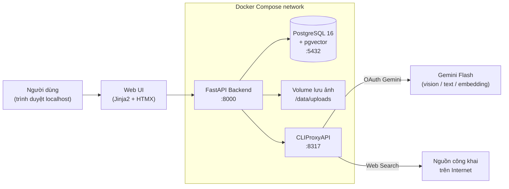
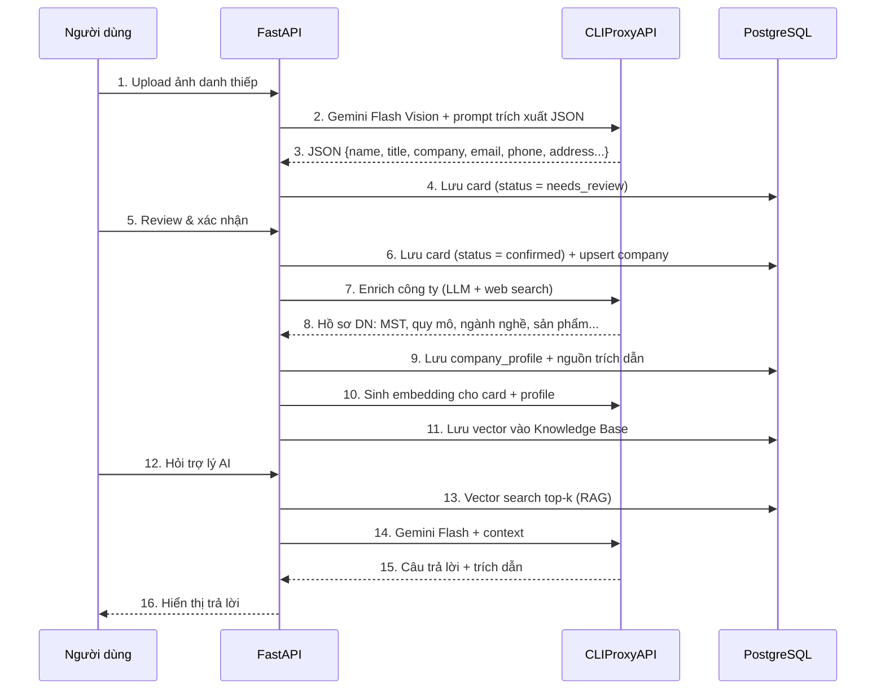

# Plan.md — Kế hoạch dự án "Số hoá danh thiếp & Hồ sơ doanh nghiệp đối tác"

> Mã dự án: **BusinessCard_OCR** · Thời gian: **11 ngày làm việc + 4 ngày dự phòng** · Nhân sự: **2 (Quân, Tùng)**
> Sản phẩm: **demo chạy localhost (môi trường dev)**, quản lý toàn bộ bằng Docker.

---

## 1. Mục tiêu & phạm vi

### 1.1 Mục tiêu
Xây dựng hệ thống giúp doanh nghiệp chuyển hoá danh thiếp thu thập tại hội thảo/triển lãm thành **hồ sơ đối tác chuẩn hoá**, loại bỏ nút thắt nhập liệu thủ công và tra cứu phân tán.

### 1.2 Ba chức năng chính
| # | Chức năng | Mô tả |
|---|-----------|-------|
| F1 | **Số hoá danh thiếp qua ảnh** | Upload/scan ảnh danh thiếp → LLM Vision (Gemini Flash) trích xuất: công ty, họ tên người đưa danh thiếp, chức vụ, email, SĐT, địa chỉ, website, ngày upload… → lưu DB, cho phép người dùng review/sửa. |
| F2 | **Hồ sơ doanh nghiệp đối tác** | Từ tên công ty thu được, dùng LLM + tìm kiếm Internet tổng hợp: mã số thuế, tên pháp lý, quy mô, ngành nghề, sản phẩm/dịch vụ, địa chỉ, website, nguồn trích dẫn → sinh Hồ sơ doanh nghiệp. |
| F3 | **Trợ lý AI hỏi–đáp (RAG)** | Chat hỏi đáp trên Knowledge Base gồm **danh thiếp đã nhập liệu + hồ sơ doanh nghiệp đã tạo**, trả lời kèm trích dẫn nguồn. |

### 1.3 Trong phạm vi
- Web app (FastAPI + giao diện web đơn giản) chạy localhost qua Docker Compose.
- Upload 1 ảnh và upload hàng loạt (batch) danh thiếp.
- Danh thiếp **đa ngôn ngữ**: Anh, Việt, Hàn, Nhật, Trung.
- **Nút bấm kết nối OAuth với CLIProxy** trên giao diện + hiển thị trạng thái kết nối.
- Quản lý mã nguồn bằng Git, đóng gói toàn bộ bằng Docker.

### 1.4 Ngoài phạm vi
- Không triển khai production, không CI/CD, không HTTPS/domain thật, không auto-scaling.
- Không làm app mobile native (dùng web + thuộc tính `capture` của trình duyệt để chụp ảnh).
- Không quản lý người dùng/phân quyền phức tạp (single-user demo).
- Không tích hợp CRM bên ngoài (chỉ export CSV/JSON).
- Chưa làm trong demo (ghi nhận cho giai đoạn sau): danh thiếp 2 mặt ghép 1 bản ghi, nhập KB từ file CSV có sẵn, dark mode / responsive mobile.

---

## 2. Kiến trúc hệ thống

### 2.1 Sơ đồ tổng thể



### 2.2 Luồng nghiệp vụ



### 2.3 Thành phần Docker

| Service | Image / Build | Port | Vai trò |
|---------|---------------|------|---------|
| `api` | build từ `./backend` (python:3.12-slim) | 8000 | FastAPI: REST API + phục vụ Web UI |
| `db` | `pgvector/pgvector:pg16` | 5432 | PostgreSQL + extension `vector` |
| `cliproxy` | build/pull CLIProxyAPI | 8317 | Cổng OAuth + gateway tới Gemini |
| `adminer` *(tuỳ chọn)* | `adminer` | 8080 | Xem DB khi debug |

Volumes: `pgdata` (DB), `uploads` (ảnh danh thiếp), `cliproxy_auths` (token OAuth — giữ lại giữa các lần restart).

### 2.4 Tích hợp CLIProxyAPI (đã khảo sát mã nguồn tại `C:\FSoft\ojt\CliProxy`)

| Việc | Endpoint | Ghi chú |
|------|----------|---------|
| Lấy URL đăng nhập OAuth | `GET http://cliproxy:8317/v0/management/{provider}-auth-url` | Route được sinh động theo provider; provider built-in gồm `anthropic`, `codex`, `antigravity`, `kimi`, `xai`; Gemini nạp qua plugin auth (`ServePluginAuthURL`) |
| Callback OAuth | `GET/POST /v0/management/oauth-callback` | CLIProxyAPI tự xử lý, lưu token vào thư mục `auths/` |
| Kiểm tra trạng thái đăng nhập | `GET /v0/management/get-auth-status` | dùng để hiển thị badge "Đã kết nối / Chưa kết nối" |
| Liệt kê tài khoản đã auth | `GET /v0/management/auth-files` | |
| Huỷ phiên OAuth | `DELETE /v0/management/oauth-session` | |
| Gọi model (Gemini native) | `POST /v1beta/models/gemini-flash-latest:generateContent` | dùng cho vision + text |
| Gọi model (OpenAI-compatible) | `POST /v1/chat/completions` | phương án thay thế |
| Embedding | `POST /v1beta/models/text-embedding-004:embedContent` | nếu không khả dụng → fallback (mục 6, R2) |

> Các route `/v0/management/*` yêu cầu **management key** (khai trong `config.yaml` của CLIProxyAPI, truyền vào backend qua biến môi trường `CLIPROXY_MGMT_KEY`) và chỉ bật khi `home.enabled = false`. Backend đóng vai trò proxy để Web UI chỉ cần bấm 1 nút.

### 2.5 Nút bấm kết nối OAuth (yêu cầu bắt buộc)

Trang `/settings` gồm:
1. Badge trạng thái: **Chưa kết nối / Đã kết nối** (kèm tài khoản, danh sách model khả dụng).
2. Nút **"Kết nối CLIProxy (OAuth)"** → backend gọi `…-auth-url` → mở tab mới tới URL OAuth của Google.
3. Người dùng đồng ý → CLIProxy nhận callback → UI **poll** `get-auth-status` mỗi 2 giây → badge tự chuyển sang "Đã kết nối".
4. Nút **"Kiểm tra kết nối"** (gọi thử 1 prompt ngắn tới Gemini Flash) và nút **"Ngắt kết nối"**.

---

## 3. Thiết kế dữ liệu (PostgreSQL)

```
business_cards
  id (uuid, pk), image_path, image_hash, uploaded_at, ocr_raw_json (jsonb),
  full_name, job_title, company_name_raw, email, phone, phone_alt, address,
  website, language_detected, confidence (jsonb),
  status (pending | needs_review | confirmed),
  company_id (fk -> companies.id, nullable), notes, created_at, updated_at

companies
  id (uuid, pk), name_normalized (unique), display_name, aliases (text[]),
  created_at, updated_at

company_profiles
  id (uuid, pk), company_id (fk), legal_name, tax_code, founded_year,
  size_label, employee_range, industry (text[]), products (text[]),
  address, website, phone, email, description, sources (jsonb),
  llm_model, generated_at, status (draft | generated | verified),
  created_at, updated_at

kb_chunks                      -- Knowledge Base cho RAG
  id (uuid, pk), source_type (card | company_profile), source_id (uuid),
  content (text), metadata (jsonb), embedding (vector(768)), created_at

chat_sessions / chat_messages
  session_id, role (user | assistant), content, citations (jsonb), created_at

integration_status             -- cache trạng thái OAuth CLIProxy
  provider, connected (bool), account_label, last_checked_at
```

Index: `ivfflat` trên `kb_chunks.embedding` (cosine); unique trên `business_cards.image_hash` để chống upload trùng; GIN trên `company_profiles.industry`.

---

## 4. API dự kiến

| Nhóm | Endpoint | Mô tả |
|------|----------|-------|
| Integration | `GET /api/integration/status` · `POST /api/integration/connect` · `POST /api/integration/disconnect` · `POST /api/integration/test` | Nút OAuth CLIProxy |
| Cards | `POST /api/cards/upload` · `POST /api/cards/batch-upload` · `GET /api/cards` (filter/search/paging) · `GET /api/cards/{id}` · `PATCH /api/cards/{id}` · `POST /api/cards/{id}/confirm` · `DELETE /api/cards/{id}` · `GET /api/cards/export.csv` | F1 |
| Companies | `GET /api/companies` · `GET /api/companies/{id}` · `POST /api/companies/{id}/enrich` · `PATCH /api/companies/{id}/profile` · `GET /api/companies/{id}/contacts` | F2 |
| Assistant | `POST /api/chat` (câu hỏi → trả lời + citations) · `GET /api/chat/{session_id}` · `POST /api/kb/reindex` | F3 |
| Ops | `GET /health` · `GET /api/stats` (số danh thiếp, số hồ sơ, tỉ lệ cần review) | Dashboard |

---

## 5. Phân công

### 5.1 Theo yêu cầu
| Thành viên | Mảng phụ trách |
|-----------|----------------|
| **Quân** | OCR danh thiếp (F1), Trợ lý AI/RAG (F3), Git repo, Docker & docker-compose, tích hợp OAuth CLIProxy, LLM client dùng chung |
| **Tùng** | Hồ sơ doanh nghiệp đối tác (F2): enrichment bằng LLM + tìm kiếm Internet, chuẩn hoá/dedupe công ty, UI hồ sơ DN |

### 5.2 Các việc phát sinh — tự phân công

Nguyên tắc: **mỗi việc chỉ có đúng 1 người chịu trách nhiệm**, và việc nào chạm cùng một file thì
giao cho cùng một người để tránh xung đột Git (bảng sở hữu file chi tiết ở đầu `Task.md`).

| Việc phát sinh | Giao cho | Lý do |
|----------------|----------|-------|
| Schema DB & toàn bộ Alembic migration | Quân | Chỉ 1 người sinh revision, tránh 2 head phải merge tay; Tùng review qua PR |
| Web UI khung (`base.html`, nav, static) | Quân | Gắn liền với FastAPI skeleton, là file dùng chung |
| Web UI danh sách/chi tiết/review danh thiếp | Quân | Thuộc F1, cùng thư mục `templates/cards/` |
| Web UI hồ sơ doanh nghiệp + dashboard | Tùng | Thuộc F2, cùng thư mục `templates/companies/` |
| `services/llm.py` (client Gemini dùng chung) | Quân | File dùng chung; Quân cần vision + streaming, Tùng chỉ import |
| `services/normalize.py` (chuẩn hoá SĐT/email **và** tên công ty) | Tùng | Gộp về 1 chủ sở hữu vì cùng một file |
| Bộ dữ liệu test (≥30 danh thiếp đa ngôn ngữ) | Tùng | Làm song song khi Quân dựng pipeline |
| Prompt OCR & tinh chỉnh độ chính xác | Quân | Thuộc F1 |
| Prompt enrichment + chống bịa thông tin | Tùng | Thuộc F2 |
| Ingest KB (chunk + embedding) | Quân | Thuộc F3; Tùng chỉ gọi hàm `kb.ingest_company_profile()` |
| Export CSV/JSON | Tùng | Đặt ở `routers/export.py` riêng để không đụng `cards.py` của Quân |
| Hạ tầng test (`conftest.py`) + test F1/F3 | Quân | |
| Test F2 (normalize, matching, enrichment, API companies) | Tùng | Mỗi người test phần mình, file test tách riêng |
| Nhật ký bug | Tách 2 file: Quân giữ `bugs-f1-f3.md`, Tùng giữ `bugs-f2.md` | Tránh 2 người sửa cùng 1 file trong ngày kiểm thử |
| README + hướng dẫn OAuth | Quân | |
| Tài liệu HDSD, kịch bản demo, slide | Tùng | |
| Video demo dự phòng | Quân | |

### 5.3 Quy ước làm việc
- Git flow đơn giản: `main` (ổn định) ← PR từ `feat/<module>-<việc>`; commit theo Conventional Commits.
- **Mỗi task 1 owner duy nhất; không sửa file thuộc quyền sở hữu của người kia** — cần đổi thì báo chủ file. Bảng sở hữu file/module nằm ở đầu `Task.md`.
- **Không xếp hai người vào cùng một file trong cùng một ngày**; bất khả kháng thì làm tuần tự, người sau rebase trước khi sửa.
- `app/main.py` và `routers/__init__.py` khai báo sẵn stub toàn bộ router từ D1 → về sau không ai phải sửa file chung khi thêm tính năng.
- Daily sync 15 phút đầu ngày: hôm qua / hôm nay / vướng gì; ai cần chạm file của ai thì báo tại đây.
- Mọi thay đổi schema đều qua Alembic migration do Quân tạo, không sửa tay DB.
- Định nghĩa "Xong" (DoD): code chạy được trong Docker + có test hoặc kịch bản thử tay + đã merge vào `main`.

---

## 6. Rủi ro & phương án dự phòng

| # | Rủi ro | Ảnh hưởng | Phương án xử lý |
|---|--------|-----------|-----------------|
| R1 | OAuth CLIProxy lỗi / token hết hạn giữa buổi demo | Cao | Nút "Kiểm tra kết nối"; giữ token trong volume `cliproxy_auths`; dự phòng cấu hình Gemini API key trực tiếp trong CLIProxy |
| R2 | CLIProxy không hỗ trợ endpoint embedding | Trung bình | Fallback 1: `sentence-transformers` (multilingual-e5-small) chạy trong container. Fallback 2: RAG bằng full-text search `tsvector` của PostgreSQL |
| R3 | OCR sai với danh thiếp Hàn/Nhật/Trung hoặc ảnh mờ | Cao | Bắt buộc bước người dùng review trước khi confirm; tiền xử lý ảnh (resize, tăng tương phản); prompt yêu cầu trả `confidence` từng trường |
| R4 | LLM bịa thông tin doanh nghiệp (mã số thuế sai) | Cao | Bắt buộc trả `sources` (URL) cho mỗi trường; trường không có nguồn → `null` + nhãn "chưa xác minh"; UI hiển thị rõ nguồn |
| R5 | Rate limit / chậm khi upload hàng loạt | Trung bình | Xử lý nền bằng `BackgroundTasks` + hàng đợi đơn giản trong DB, giới hạn đồng thời, retry có backoff |
| R6 | Trùng công ty do viết khác nhau ("FPT Software" vs "Cty FPT Software") | Trung bình | Chuẩn hoá tên (bỏ hậu tố pháp lý, lowercase, bỏ dấu) + so khớp mờ; cho phép gộp thủ công |
| R7 | Chậm tiến độ do tích hợp | Trung bình | Ưu tiên MUST trước, cắt SHOULD/COULD nếu cần. 4 ngày dự phòng (D12–D15) **không được lên lịch trước công việc nào** — chỉ dùng khi thực tế phát sinh (xem Task.md, mục D12–D15) |

**Ưu tiên khi phải cắt phạm vi:**
- **MUST:** F1 + F2 + F3 luồng cơ bản, nút OAuth, Docker Compose.
- **SHOULD:** batch upload, export CSV, dashboard thống kê.
- **COULD:** gộp công ty thủ công, chat streaming, gợi ý câu hỏi mẫu.

---

## 7. Lộ trình tổng thể (11 ngày + 4 dự phòng)

| Giai đoạn | Ngày | Nội dung | Kết quả bàn giao |
|-----------|------|----------|------------------|
| **P0 — Khởi động** | D1 | Chốt yêu cầu, thiết kế DB & API, dựng repo + Docker skeleton | `docker compose up` ra `/health`, ERD, API spec |
| **P1 — Nền tảng AI** | D2 | Tích hợp CLIProxy: OAuth + LLM client + nút kết nối trên UI | Bấm nút → OAuth thành công → gọi thử Gemini Flash OK |
| **P2 — F1 OCR** | D3–D4 | Upload ảnh → trích xuất → lưu DB → UI review/sửa/danh sách | Số hoá được danh thiếp đầu–cuối |
| **P3 — F2 Hồ sơ DN** | D5–D6 | Enrichment công ty bằng LLM + web search, dedupe, UI hồ sơ | Từ 1 danh thiếp sinh hồ sơ DN có trích dẫn nguồn |
| **P4 — F3 RAG** | D7–D8 | Ingest KB, vector search, API + UI chat có trích dẫn | Hỏi "Công ty X làm gì?" → trả lời đúng kèm nguồn |
| **P5 — Hoàn thiện** | D9 | Batch upload, đa ngôn ngữ, export, dashboard, gom Docker | Compose 1 lệnh chạy toàn hệ thống |
| **P6 — Kiểm thử** | D10 | Test đầu–cuối, sửa lỗi, dữ liệu mẫu, đo độ chính xác | Báo cáo test, danh sách bug đã đóng |
| **P7 — Bàn giao** | D11 | README, tài liệu, kịch bản + tổng duyệt demo | Bản demo hoàn chỉnh + tài liệu |
| **Dự phòng** | D12–D15 | **Không đặt trước công việc nào.** Chỉ dùng cho: kiểm thử hồi quy, sửa bug phát sinh, hoặc chức năng mới phát sinh sau khi kế hoạch đã chốt | Bản ổn định cuối cùng |

Chi tiết công việc từng ngày: xem **[Task.md](./Task.md)**.

---

## 8. Tiêu chí nghiệm thu

| # | Tiêu chí | Cách đo |
|---|----------|---------|
| A1 | `docker compose up -d` khởi động toàn bộ hệ thống, truy cập `http://localhost:8000` | Máy sạch, chạy 1 lệnh |
| A2 | Có nút kết nối OAuth CLIProxy, bấm là kết nối được và hiển thị đúng trạng thái | Thao tác tay |
| A3 | Upload ảnh danh thiếp → trích xuất đủ 7 trường bắt buộc (tên, chức vụ, công ty, email, SĐT, địa chỉ, ngày upload) | 30 ảnh mẫu, độ chính xác trường ≥ 85% với ảnh rõ nét |
| A4 | Hỗ trợ danh thiếp Anh/Việt + ít nhất 1 trong Hàn/Nhật/Trung | Bộ ảnh test đa ngôn ngữ |
| A5 | Sinh hồ sơ doanh nghiệp với ≥ 5 trường (MST, quy mô, ngành nghề, sản phẩm, địa chỉ) kèm nguồn | 10 công ty mẫu |
| A6 | Trợ lý AI trả lời đúng ≥ 8/10 câu hỏi mẫu về danh thiếp & doanh nghiệp trong KB, có trích dẫn | Bộ câu hỏi kiểm thử |
| A7 | Toàn bộ mã nguồn trên Git, có README hướng dẫn cài đặt & chạy | Review repo |

---

## 9. Công nghệ

- **Backend:** Python 3.12, FastAPI, Pydantic v2, SQLAlchemy 2.0, Alembic, httpx, Pillow.
- **Database:** PostgreSQL 16 + pgvector.
- **AI:** Gemini Flash (vision + text + embedding) **qua CLIProxyAPI bằng OAuth** — không nhúng API key trong ứng dụng.
- **Frontend:** Jinja2 + HTMX + TailwindCSS (CDN) — đủ cho demo, không cần build step.
- **Hạ tầng:** Docker, Docker Compose.
- **Test:** pytest, pytest-asyncio, respx (mock HTTP).
