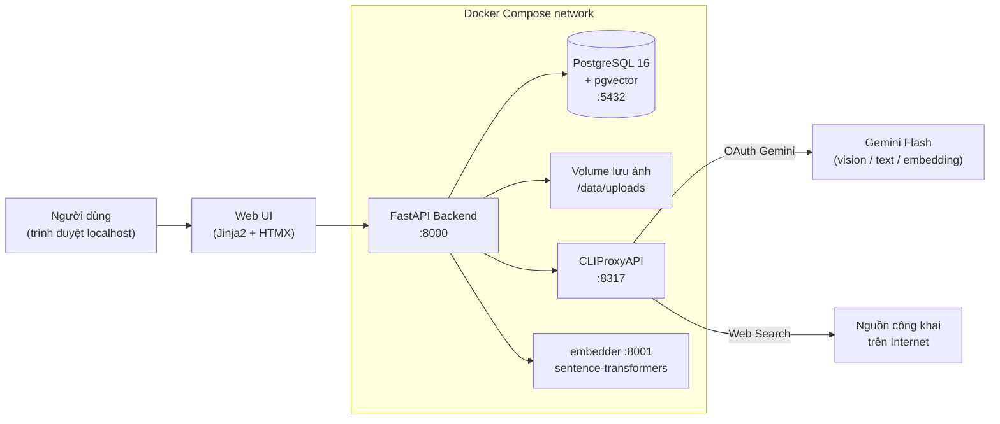
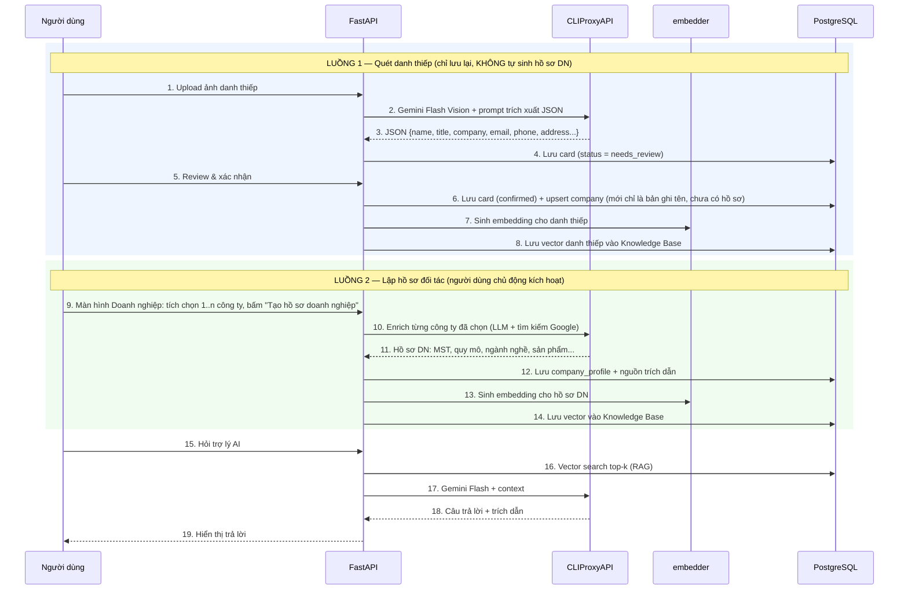
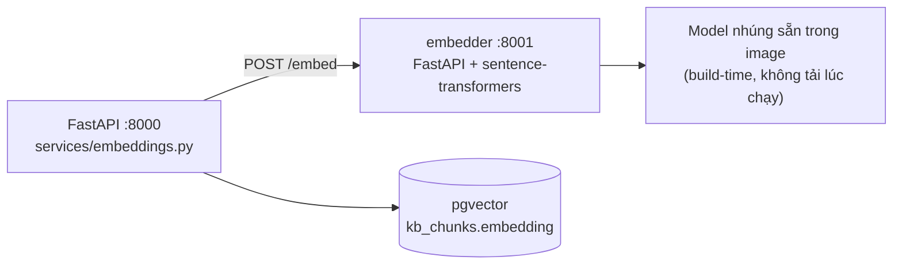
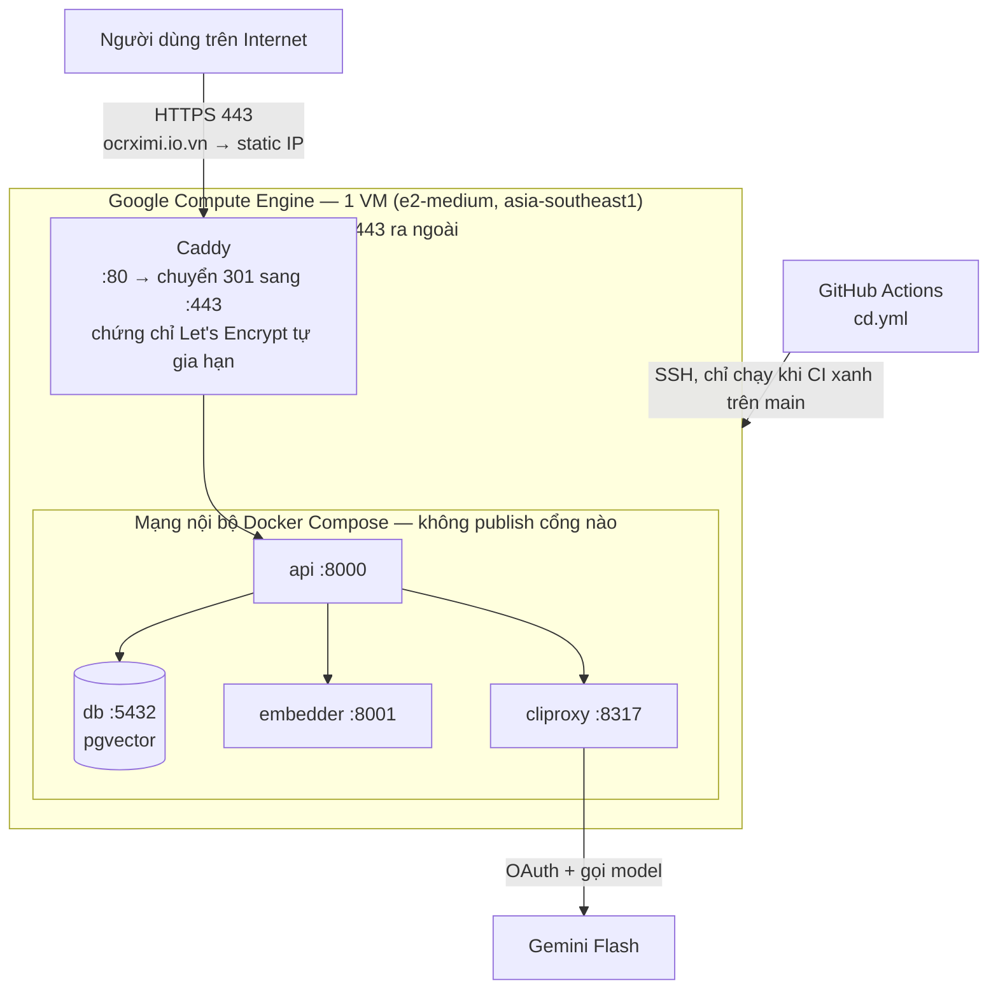

# Plan.md — Kế hoạch dự án "Số hoá danh thiếp & Hồ sơ doanh nghiệp đối tác"

> Mã dự án: **BusinessCard_OCR** · Thời gian: **13 ngày làm việc + 2 ngày dự phòng** · Nhân sự: **2 (Quân, Tùng)**
> Sản phẩm: **bản chạy được trên Internet tại `https://ocrximi.io.vn`**, nhiều người dùng, quản lý toàn bộ bằng Docker.

> ⚠️ **Sửa phạm vi ngày 2026-09-21 — đọc kỹ trước khi dùng lại tài liệu này.**
> Chủ dự án bổ sung hai yêu cầu **sau khi kế hoạch đã chốt**, đúng loại việc mà `Task.md` mục
> D12–D15 cho phép ("chức năng mới phát sinh"):
> 1. **Đăng nhập / đăng ký nhiều người dùng**, mỗi người có danh thiếp – hồ sơ – lịch sử chat
>    riêng, và **mỗi người tự kết nối OAuth với AI qua CLIProxy**.
> 2. **Triển khai CD + đưa lên tên miền `ocrximi.io.vn`** để người ngoài dùng được.
>
> Hai yêu cầu này **đảo ngược ba dòng "ngoài phạm vi"** ở mục 1.4 (không CD, không domain thật,
> không quản lý người dùng). Phần đảo ngược ghi rõ tại chỗ, không xoá dấu vết.
> Hệ quả: **D12–D13 nay có công việc đặt trước** (trước đây cấm), chỉ còn **D14–D15 là dự phòng**.
> Kèm theo đó, quy ước "không sửa file của người kia" được **nới từ D12** — xem `Task.md`.

---

## 1. Mục tiêu & phạm vi

### 1.1 Mục tiêu
Xây dựng hệ thống giúp doanh nghiệp chuyển hoá danh thiếp thu thập tại hội thảo/triển lãm thành **hồ sơ đối tác chuẩn hoá**, loại bỏ nút thắt nhập liệu thủ công và tra cứu phân tán.

### 1.2 Ba chức năng chính
| # | Chức năng | Mô tả |
|---|-----------|-------|
| F1 | **Số hoá danh thiếp qua ảnh** | Upload/scan ảnh danh thiếp → LLM Vision (Gemini Flash) trích xuất: công ty, họ tên người đưa danh thiếp, chức vụ, email, SĐT, địa chỉ, website, ngày upload… → lưu DB, cho phép người dùng review/sửa. |
| F2 | **Hồ sơ doanh nghiệp đối tác** | **Người dùng chủ động tích chọn 1 hoặc nhiều công ty** đã thu được từ danh thiếp rồi bấm “Tạo hồ sơ doanh nghiệp” — hệ thống **không** tự sinh. Với mỗi công ty được chọn, dùng LLM + tìm kiếm Internet tổng hợp: mã số thuế, tên pháp lý, quy mô, ngành nghề, sản phẩm/dịch vụ, địa chỉ, website, nguồn trích dẫn → sinh Hồ sơ doanh nghiệp. |
| F3 | **Trợ lý AI hỏi–đáp (RAG)** | Chat hỏi đáp trên Knowledge Base gồm **danh thiếp đã nhập liệu + hồ sơ doanh nghiệp đã tạo**, trả lời kèm trích dẫn nguồn. |
| F4 | **Tài khoản & tách dữ liệu theo người dùng** *(bổ sung 2026-09-21, làm ở D12–D13)* | Đăng ký – đăng nhập – đăng xuất bằng email + mật khẩu. Mỗi người dùng **chỉ thấy danh thiếp, công ty, hồ sơ và lịch sử chat của chính mình**; Knowledge Base của RAG cũng cắt theo người dùng. Mỗi người **tự bấm nút kết nối OAuth CLIProxy bằng tài khoản Google của mình**, lời gọi LLM đi bằng credential của chính người đó. |

### 1.3 Trong phạm vi
- Web app (FastAPI + giao diện web đơn giản) chạy localhost qua Docker Compose.
- Upload 1 ảnh và upload hàng loạt (batch) danh thiếp; danh thiếp đã quét nằm ở một màn hình danh sách riêng.
- **Lập hồ sơ đối tác kích hoạt thủ công**: màn hình Doanh nghiệp cho tích chọn 1..n công ty rồi chạy bằng một nút, có theo dõi tiến trình.
- Danh thiếp **đa ngôn ngữ**: ~~Anh, Việt, Hàn, Nhật, Trung.~~
  **Mở rộng 2026-09-22 (yêu cầu của chủ dự án, mục `EX` của `Task.md`): KHÔNG giới hạn ngôn ngữ nào** —
  năm thứ tiếng trên chỉ còn là bộ được đo kỹ nhất. Kèm theo đó là **bước Việt hoá sau khi quét**: chức vụ
  và loại hình pháp nhân (株式会社, Co., Ltd, 주식회사…) được **dịch nghĩa**, tên riêng (người, công ty, địa
  danh) được **phiên âm theo lối người Việt viết** — tiếng Nhật → Romaji, tiếng Trung → âm Hán Việt, còn lại
  → dạng Latin thông dụng. **Bản gốc không bị ghi đè**, nó hiện làm chú thích nhỏ ngay dưới bản dịch.
- **Nút bấm kết nối OAuth với CLIProxy** trên giao diện + hiển thị trạng thái kết nối.
- Quản lý mã nguồn bằng Git, đóng gói toàn bộ bằng Docker.
- *(Bổ sung 2026-09-21)* **Đăng ký/đăng nhập nhiều người dùng + tách dữ liệu theo người dùng** (F4).
- *(Bổ sung 2026-09-24, mục `EX — Đợt 2` của `Task.md`)* **Trợ lý AI chỉ còn ở dạng bong bóng chat**, hỏi được
  từ mọi trang; ~~màn hình `/assistant` riêng~~ **bỏ** — URL cũ giữ lại một `301` để link `?session=` đã chia sẻ
  vẫn mở đúng hội thoại.
- *(Bổ sung 2026-09-24)* **Mỗi người dùng tự chọn model cho từng chức năng**: quét danh thiếp (kèm bước Việt hoá),
  lập hồ sơ doanh nghiệp, trợ lý AI — ba chức năng **được dùng ba model khác nhau**, chọn ngay trên `/settings`,
  lưu theo từng tài khoản. `LLM_MODEL` trong `.env` **hạ xuống thành giá trị mặc định** cho ai chưa chọn gì.
  Danh sách model chọn được **lọc theo năng lực đo thật** (nhận ảnh / tra cứu Internet), không thả cả danh mục.
- *(Bổ sung 2026-09-21)* **Triển khai công khai**: **một máy ảo Google Compute Engine** chạy đúng bộ Docker Compose hiện có,
  Caddy làm reverse proxy + HTTPS Let's Encrypt, tên miền **`ocrximi.io.vn`** (đã mua, tự quản lý DNS),
  và **CD bằng GitHub Actions**: `main` xanh CI → tự deploy → smoke test → hỏng thì quay về bản trước.

### 1.4 Ngoài phạm vi
- ~~Không triển khai production, **không CD** (không tự động deploy), không HTTPS/domain thật~~,
  không auto-scaling, không cân bằng tải, không hạ tầng nhiều máy chủ.
  **Đảo ngược 2026-09-21:** nay **có** CD, **có** HTTPS + tên miền thật `ocrximi.io.vn` trên **một** VPS
  (xem mục 1.3 và mục 10). Phần vẫn ngoài phạm vi: auto-scaling, nhiều máy chủ, blue-green/canary,
  giám sát chuyên dụng (Prometheus/Grafana), SLA.
  *(Có **CI kiểm tra chất lượng** trên PR — lint, kiểu, test, quét secret, một head Alembic. Xem `.github/workflows/README.md`.)*
- Không làm app mobile native (dùng web + thuộc tính `capture` của trình duyệt để chụp ảnh).
- ~~Không quản lý người dùng/phân quyền phức tạp (single-user demo).~~
  **Đảo ngược 2026-09-21:** nay **có** đăng nhập nhiều người dùng và tách dữ liệu theo người dùng (F4).
  Phần vẫn ngoài phạm vi: phân quyền theo vai trò (admin/member), mời thành viên, chia sẻ dữ liệu giữa
  các tài khoản, xác thực email, quên mật khẩu qua email, đăng nhập bằng mạng xã hội, 2FA.
- Không tích hợp CRM bên ngoài (chỉ export CSV/JSON).
- Chưa làm trong demo (ghi nhận cho giai đoạn sau): danh thiếp 2 mặt ghép 1 bản ghi, nhập KB từ file CSV có sẵn, dark mode / responsive mobile.

---

## 2. Kiến trúc hệ thống

### 2.1 Sơ đồ tổng thể



### 2.2 Luồng nghiệp vụ



### 2.3 Thành phần Docker

| Service | Image / Build | Port | Vai trò |
|---------|---------------|------|---------|
| `api` | build từ `./backend` (python:3.12-slim) | 8000 | FastAPI: REST API + phục vụ Web UI |
| `db` | `pgvector/pgvector:pg16` | 5432 | PostgreSQL + extension `vector` |
| `cliproxy` | `eceasy/cli-proxy-api` (image công khai, **không build từ mã nguồn**) | 8317 + 51121 | Cổng OAuth + gateway tới Gemini. Cấu hình từ `cliproxy/config.example.yaml`; 51121 là callback OAuth của Antigravity |
| `embedder` | build từ `./embedder` (python:3.12-slim + sentence-transformers) | 8001 | Sinh vector embedding cho RAG — **model nhúng sẵn trong image lúc build**, chạy CPU, không cần mạng lúc chạy (xem mục 2.6) |
| `adminer` *(tuỳ chọn)* | `adminer` | 8080 | Xem DB khi debug |

Volumes: `pgdata` (DB), `uploads` (ảnh danh thiếp), `cliproxy_auths` (token OAuth — giữ lại giữa các lần restart).

### 2.4 Tích hợp CLIProxyAPI

> **Nguồn khảo sát:** `github.com/router-for-me/CLIProxyAPI` — commit `ecc9aa72` (bản đầu, Q) và
> `7fac6b15` (T kiểm lại ở task 1.9). **Không ghi đường dẫn tuyệt đối trên máy vào tài liệu**:
> mỗi người clone một chỗ, đường dẫn của người này luôn sai với người kia.
> Bản clone chỉ là tư liệu đọc mã nguồn — **không phải phụ thuộc lúc chạy**, service `cliproxy`
> dùng image công khai (mục 2.3).

| Việc | Endpoint | Ghi chú |
|------|----------|---------|
| Lấy URL đăng nhập OAuth | `GET http://cliproxy:8317/v0/management/{provider}-auth-url?is_webui=1` | Trả `{"status":"ok","url":…,"state":…}`. Route sinh động theo provider; built-in gồm `anthropic`, `codex`, `antigravity`, `kimi`, `xai`. **Luôn gửi `is_webui=1`** — nhánh dành cho luồng bấm nút trên UI (task 2.2) |
| Callback OAuth | `GET/POST /v0/management/oauth-callback` | CLIProxyAPI tự xử lý, lưu token vào thư mục `auths/` |
| **Badge "Đã kết nối / Chưa kết nối"** | `GET /v0/management/auth-files` | **Nguồn sự thật duy nhất** cho trạng thái. Mảng rỗng `{"files":[]}` = chưa kết nối |
| Poll trong lúc chờ người dùng đồng ý | `GET /v0/management/get-auth-status?state=…` | **CHỈ dùng cho việc này.** ⚠️ I-02: không truyền `state` thì trả `{"status":"ok"}` kể cả khi chưa đăng nhập bao giờ → dùng cho badge là lỗi âm thầm, badge sẽ luôn xanh. ⚠️ Báo lỗi bằng **HTTP 200** kèm `{"status":"error"}` — phải đọc body, không nhìn mã HTTP |
| Huỷ phiên OAuth | `DELETE /v0/management/oauth-session` | |
| Ngắt kết nối (xoá credential) | `DELETE /v0/management/auth-files?name=<tên file>` | **Bắt buộc `name`** (lấy từ `auth-files[].name`); thiếu là `400 invalid name`. Không có biến thể "xoá tất cả" → ngắt kết nối = liệt kê rồi xoá từng file (đo thật, task 2.2) |
| Danh mục model của channel | `GET /v0/management/model-definitions/antigravity` | Chốt tên model thật cho `LLM_MODEL`; danh mục tự cập nhật từ xa nên **không hardcode theo tài liệu** |
| Gọi model (Gemini native) | `POST /v1beta/models/<LLM_MODEL>:generateContent` | dùng cho vision + text. **Không cần management key** (`api-keys: []` = không kiểm tra client). Chưa kết nối OAuth thì trả `400 unknown provider for model …` — **trùng câu chữ với lỗi sai tên model**, phân biệt bằng cách tra danh mục channel (task 2.3) |
| Gọi model (OpenAI-compatible) | `POST /v1/chat/completions` | phương án thay thế |
| Embedding | **Không tồn tại** — đã kiểm chứng trong mã nguồn | Route `/v1beta/models/*action` chỉ nhận `generateContent`, `streamGenerateContent`, `countTokens`; cũng không có `/v1/embeddings`. Embedding do service `embedder` cục bộ đảm nhiệm — xem mục 2.6 |

> Các route `/v0/management/*` yêu cầu **management key** (khai ở `remote-management.secret-key`
> trong `config.yaml` của CLIProxyAPI, truyền vào backend qua biến `CLIPROXY_MGMT_KEY` — hai giá
> trị phải trùng nhau). Backend đóng vai trò proxy để Web UI chỉ cần bấm 1 nút.
>
> Ba ràng buộc bắt buộc, đã kiểm chứng bằng container thật (xem `cliproxy/config.example.yaml`):
> - **`allow-remote: true`** — CLIProxy hiểu "localhost" đúng nghĩa đen `127.0.0.1`/`::1`; container `api` gọi qua mạng bridge nên để `false` là nhận `403 remote management disabled` dù gửi đúng key (I-01).
> - **Publish cổng `51121`** — callback OAuth của Antigravity; thiếu thì token không bao giờ được lưu (I-04).
> - **Không retry khi 401/403** — sai key 5 lần là ban IP 30 phút, cả container `api` chung một IP (I-05).
>
> `secret-key` để rỗng = tắt hẳn Management API, mọi route trả **404** chứ không phải 401.
> *(Khoá `home` không tồn tại trong `config.example.yaml` của CLIProxy — không phải khai gì.)*

### 2.5 Nút bấm kết nối OAuth (yêu cầu bắt buộc)

Trang `/settings` gồm:
1. Badge trạng thái: **Chưa kết nối / Đã kết nối** (kèm tài khoản, danh sách model khả dụng) — đọc từ **`auth-files`**.
2. Nút **"Kết nối CLIProxy (OAuth)"** → backend gọi `…-auth-url`, nhận về `url` + `state` → mở tab mới tới URL OAuth của Google.
3. Người dùng đồng ý → CLIProxy nhận callback ở cổng `51121` → UI **poll `get-auth-status?state=<state vừa nhận>`** mỗi 2 giây cho tới khi `{"status":"ok"}` → **rồi mới gọi lại `auth-files`** để vẽ badge. ⚠️ Poll mà quên `state` thì lần nào cũng "ok" ngay lập tức (I-02).
4. Nút **"Kiểm tra kết nối"** (gọi thử 1 prompt ngắn tới Gemini Flash) và nút **"Ngắt kết nối"**.

### 2.6 Phương án embedding cho RAG

**Kết luận khảo sát mã nguồn CLIProxyAPI (commit `ecc9aa72`, T kiểm lại ở `7fac6b15`): CLIProxy KHÔNG có endpoint embedding.**
- Không tồn tại route `/v1/embeddings` (kiểu OpenAI).
- Route Gemini native `/v1beta/models/*action` chỉ nhận `generateContent`, `streamGenerateContent`, `countTokens` (`sdk/api/handlers/gemini/gemini_handlers.go:155`). Không có `embedContent`.
- Cảnh báo: `switch` này **không có nhánh `default`** → gọi `:embedContent` trả HTTP 200 rỗng chứ không phải 404, rất dễ hiểu nhầm là "gọi được nhưng parse lỗi".

Dùng Gemini embedding bằng API key trực tiếp cũng bị loại vì trái nguyên tắc "không nhúng API key trong ứng dụng" (mục 9).

→ **Embedding do một service cục bộ trong Docker Compose đảm nhiệm, tách khỏi CLIProxy.**

#### Kiến trúc



Tách thành service riêng thay vì nạp model thẳng trong `api` vì 4 lý do:
1. `api` được rebuild liên tục suốt 11 ngày — không nên kéo theo ~2.5GB `torch` mỗi lần build.
2. Test của Q mock bằng `respx` (đã có trong stack) — mock 1 lời gọi HTTP đơn giản hơn nhiều so với monkeypatch model trong tiến trình.
3. Đổi model chỉ cần đổi 1 biến môi trường + rebuild 1 service, không đụng `api`.
4. Ranh giới sở hữu sạch: Tùng dựng `embedder/` (thư mục mới), Quân giữ `app/` và `docker-compose.yml` — không ai phải sửa file của người kia.

#### Ứng viên đánh giá (task 2.6 trong Task.md)

| Ứng viên | Chiều | Dung lượng | Ghi chú |
|----------|-------|-----------|---------|
| **`intfloat/multilingual-e5-small`** *(mặc định đề xuất)* | 384 | ~470MB | 118M tham số, chạy CPU tốt; phủ đủ Anh/Việt/Hàn/Nhật/Trung; vector 384 chiều giữ index `ivfflat` nhẹ |
| `BAAI/bge-m3` | 1024 | ~2.2GB | Chất lượng truy hồi đa ngôn ngữ cao hơn; nặng, build & load chậm — chỉ chọn nếu e5-small trượt tiêu chí |
| *(dự phòng cuối)* full-text `tsvector` | — | — | Bỏ vector search, RAG thuần từ khoá. Chỉ dùng nếu cả hai ứng viên trên đều không chạy nổi |

#### Lưu ý bắt buộc khi triển khai

- **Tiền tố của họ e5**: khi index phải thêm `passage: `, khi truy vấn phải thêm `query: `. Quên bước này thì chất lượng truy hồi tụt rõ rệt — đây là lỗi âm thầm, không báo lỗi.
- **Nhúng model vào image lúc build**, không tải từ HuggingFace lúc chạy — nếu không, máy sạch không có mạng sẽ hỏng demo (tiêu chí A1).
- Chuẩn hoá vector (L2) và dùng khoảng cách cosine, khớp với index `ivfflat` đã thiết kế.
- Chiều vector phải chốt **trước D6**; đổi model khác chiều thì cần Q sinh thêm một Alembic revision đổi kiểu cột.

#### Hợp đồng API của `embedder`

```
POST /embed   { "texts": ["..."], "kind": "passage" | "query" }
           →  { "vectors": [[...]], "dim": 384, "model": "..." }
GET  /health  → { "status": "ok", "model": "...", "dim": 384 }
```

---

## 3. Thiết kế dữ liệu (PostgreSQL)

```
users                          -- F4, thêm ở D12 (revision 0005)
  id (uuid, pk), email (unique, lowercase), password_hash, display_name,
  is_active (bool), cliproxy_auth_file (text, nullable),   -- tên file credential ở auth-files[].name
  last_login_at, created_at, updated_at

business_cards
  user_id (fk -> users.id, NOT NULL)                       -- thêm ở D12
  id (uuid, pk), image_path, image_hash, uploaded_at, ocr_raw_json (jsonb),
  full_name, job_title, company_name_raw, email, phone, phone_alt, address,
  website, language_detected, confidence (jsonb),
  full_name_vi, job_title_vi, company_name_vi, address_vi,   -- Việt hoá, thêm ở EX (revision 0006)
  translation_meta (jsonb),                                  -- nguồn bản dịch, ngôn ngữ/hệ chữ, cờ stale
  status (pending | needs_review | confirmed),
  company_id (fk -> companies.id, nullable), notes, created_at, updated_at,
  relationship_status (new | contacted | talking | won | lost | closed),   -- NEXT-01 (revision 0008); tách won/lost giữ lại sau khi NEXT-03 bị cắt
  follow_up_at (date, nullable),                             -- ngày cần liên hệ lại; NULL = không hẹn
  merged_into_id (fk -> business_cards.id, nullable, SET NULL),  -- gộp mềm, NEXT-04 (revision 0010)

contact_notes                  -- NEXT-01, thêm 2026-09-24 (revision 0008)
  id (uuid, pk), user_id (fk -> users.id, on delete cascade),
  card_id (fk -> business_cards.id, on delete cascade),
  body (text), created_at (default clock_timestamp())        -- KHÔNG now(): now() là giờ bắt đầu transaction, nhiều ghi chú cùng transaction sẽ trùng mốc và mất thứ tự

profile_changes                -- NEXT-06, thêm 2026-09-25 (revision 0011)
  id (uuid, pk), user_id (fk), company_id (fk -> companies.id, on delete cascade),
  changes (jsonb), notable (bool), acknowledged_at (nullable), detected_at

privacy_logs                   -- NEXT-07, thêm 2026-09-25 (revision 0012)
  id (uuid, pk), user_id (fk -> users.id, on delete cascade),
  action (export | erase | retention), detail (jsonb), record_count, created_at
  -- KHÔNG có khoá ngoại tới business_cards: dòng nhật ký phải sống lâu hơn dữ liệu nó nói về

companies
  user_id (fk -> users.id, NOT NULL)                       -- thêm ở D12
  id (uuid, pk), name_normalized, display_name, aliases (text[]),
  created_at, updated_at

company_profiles
  id (uuid, pk), company_id (fk), legal_name, tax_code, founded_year,
  size_label, employee_range, industry (text[]), products (text[]),
  address, website, phone, email, description, sources (jsonb),
  llm_model, generated_at, status (draft | generated | verified),
  created_at, updated_at

kb_chunks                      -- Knowledge Base cho RAG
  user_id (fk -> users.id, NOT NULL)                       -- thêm ở D12
  id (uuid, pk), source_type (card | company_profile), source_id (uuid),
  content (text), metadata (jsonb), embedding (vector(384)), created_at   -- 384 = multilingual-e5-small, chốt ở ADR (mục 2.6)

chat_sessions / chat_messages
  user_id (fk -> users.id, NOT NULL) trên chat_sessions    -- thêm ở D12
  session_id, role (user | assistant), content, citations (jsonb), created_at

user_model_prefs               -- EX đợt 2, thêm 2026-09-24 (revision 0007)
  user_id (uuid, pk, fk -> users.id, on delete cascade),
  ocr_model, enrich_model, chat_model (text, nullable),   -- NULL = dùng LLM_MODEL của hệ thống
  updated_at

integration_status             -- cache trạng thái OAuth CLIProxy
  user_id (fk -> users.id)                                 -- thêm ở D12: trạng thái theo từng người
  provider, connected (bool), account_label, last_checked_at
```

Index: `ivfflat` trên `kb_chunks.embedding` (cosine); GIN trên `company_profiles.industry`.

Hai index **partial** thêm ở đợt `NEXT` (2026-09-24) — chỉ số hoá đúng phần dòng cần đến:

| Index | Mệnh đề | Vì sao partial |
|-------|---------|----------------|
| `ix_business_cards_follow_up` (`user_id`, `follow_up_at`) | `WHERE follow_up_at IS NOT NULL` | Phần lớn thẻ không có hẹn; khối *Cần liên hệ hôm nay* chỉ hỏi những dòng có hẹn |
| `ix_business_cards_merged_into` (`merged_into_id`) | `WHERE merged_into_id IS NOT NULL` | Gần hết bảng để `NULL` ở cột này; câu duy nhất cần tới index là "liệt kê những thẻ đã gộp vào thẻ X" (`NEXT-04`) |
| `ix_profile_changes_unseen` (`user_id`, `detected_at`) | `WHERE acknowledged_at IS NULL` | Màn hình chỉ hỏi "còn thay đổi nào chưa xem không"; dòng đã xem là phần lớn bảng sau vài tuần (`NEXT-06`) |

**Đổi ràng buộc unique ở D12 — đây là chỗ dễ hỏng nhất khi lên đa người dùng.** Hai ràng buộc dưới đây
đang là **unique toàn cục**; để nguyên thì người dùng B upload đúng tấm danh thiếp mà A đã upload sẽ bị
hệ thống từ chối và còn **lộ ra rằng A đã có tấm thẻ đó**:

| Ràng buộc | Trước D12 | Từ D12 |
|-----------|-----------|--------|
| Chống upload trùng ảnh | `unique(business_cards.image_hash)` | `unique(user_id, image_hash)` |
| Chống trùng công ty | `unique(companies.name_normalized)` | `unique(user_id, name_normalized)` |

Migration `0005` phải **gán dữ liệu cũ về một tài khoản khởi tạo sẵn** trước khi đặt `NOT NULL`, nếu không
`alembic upgrade head` chết ngay trên máy đang có dữ liệu (và trên VPS sau này).

---

## 4. API dự kiến

| Nhóm | Endpoint | Mô tả |
|------|----------|-------|
| **Auth** *(D12)* | `GET /auth/register` · `POST /auth/register` · `GET /auth/login` · `POST /auth/login` · `POST /auth/logout` · `GET /auth/me` · `POST /auth/change-password` | F4. Trả HTML (form) cho trình duyệt; session nằm trong cookie ký, `HttpOnly` + `SameSite=Lax` (+ `Secure` khi chạy sau HTTPS) |
| Integration | `GET /api/integration/status` · `POST /api/integration/connect` · `POST /api/integration/disconnect` · `POST /api/integration/test` | Nút OAuth CLIProxy. **Từ D13: mọi endpoint chỉ thao tác trên credential của chính người đang đăng nhập** |
| Cards | `POST /api/cards/upload` · `POST /api/cards/batch-upload` · `GET /api/cards` (filter/search/paging) · `GET /api/cards/{id}` · `PATCH /api/cards/{id}` · `POST /api/cards/{id}/confirm` · `DELETE /api/cards/{id}` · `GET /api/cards/export.csv` | F1 |
| Companies | `GET /api/companies` · `GET /api/companies/{id}` · `POST /api/companies/{id}/enrich` (1 công ty) · **`POST /api/companies/enrich-batch`** (nhận `company_ids[]`, trả `job_id`) · **`GET /api/companies/enrich-jobs/{job_id}`** (tiến trình từng công ty) · `PATCH /api/companies/{id}/profile` · `GET /api/companies/{id}/contacts` | F2 |
| Assistant | `POST /api/chat` (câu hỏi → trả lời + citations) · `GET /api/chat/{session_id}` · `POST /api/kb/reindex` | F3. *(Từ EX đợt 2, 2026-09-24: trang `/assistant` bỏ — trợ lý chỉ còn ở bong bóng chat trên mọi trang; `GET /assistant` giữ lại đúng một `301` về `/?chat=<session_id>`)* |
| Model theo chức năng *(EX đợt 2)* | `GET /api/integration/models` · `PUT /api/integration/models` | Đọc/ghi lựa chọn model của **chính người đang đăng nhập** cho ba chức năng `ocr` / `enrich` / `chat`. `PUT` từ chối model không có trong danh mục thật của channel (I-03) hoặc không đủ năng lực cho chức năng đó (I-33). Bỏ trống = dùng `LLM_MODEL` |
| **Theo dõi liên hệ** *(NEXT-01, 2026-09-24)* | `GET /api/contacts/due` · `GET\|PATCH /api/contacts/{card_id}` · `POST /api/contacts/{card_id}/notes` · `DELETE /api/contacts/{card_id}/notes/{note_id}` | Trạng thái quan hệ, ngày hẹn liên hệ lại, dòng thời gian ghi chú. `PATCH` phân biệt *không gửi trường* (giữ nguyên) với *gửi `null`* (xoá hẹn) |
| **Gộp liên hệ trùng** *(NEXT-04, 2026-09-24)* | `GET /api/duplicates` · `POST /api/duplicates/merge` · `POST /api/duplicates/unmerge` | Máy chỉ **gợi ý**, không có đường nào tự gộp. Gộp là **gộp mềm**: bản trùng ở lại, mang `merged_into_id`, biến khỏi mọi danh sách nhưng gỡ gộp được |
| **Làm mới hồ sơ** *(NEXT-06, 2026-09-25)* | `GET /api/refresh/stale` · `GET /api/refresh/changes` · `POST /api/refresh/changes/{id}/ack` | Hồ sơ quá hạn được gom sẵn thành một lượt chạy `enrich-batch`; chỉ báo phần thật sự khác |
| **Dữ liệu cá nhân** *(NEXT-07, 2026-09-25)* | `GET /api/privacy/logs` · `GET\|PUT /api/privacy/retention` · `POST /api/privacy/purge` · `POST /api/privacy/subject` · `POST /api/privacy/erase` | Nghị định 13/2023: nhật ký truy xuất, hạn lưu trữ, xoá theo yêu cầu của chủ thể dữ liệu. **Không có gì tự xoá** |
| Ops | `GET /health` · `GET /api/stats` (số danh thiếp, số hồ sơ, tỉ lệ cần review) | Dashboard. `GET /health` là endpoint **duy nhất không cần đăng nhập** ngoài `/auth/*` và `/static/*` — CD dùng nó làm smoke test |

> **Từ D12, mọi endpoint còn lại đều đòi đăng nhập.** Chưa đăng nhập: request HTML → `303` về `/auth/login`;
> request API → `401`. Truy cập tài nguyên của người khác trả **`404`, không phải `403`** — `403` là tự
> khai rằng tài nguyên đó tồn tại.

---

## 5. Phân công

### 5.1 Theo yêu cầu
| Thành viên | Mảng phụ trách |
|-----------|----------------|
| **Quân** | OCR danh thiếp (F1) — gồm cả hậu xử lý & tối ưu độ chính xác sau khi quét, Trợ lý AI/RAG (F3), Git repo, Docker & docker-compose, tích hợp OAuth CLIProxy, LLM client dùng chung |
| **Tùng** | Hồ sơ doanh nghiệp đối tác (F2): enrichment bằng LLM + tìm kiếm Internet, chuẩn hoá/dedupe công ty, UI hồ sơ DN |

### 5.2 Các việc phát sinh — tự phân công

Nguyên tắc: **mỗi việc chỉ có đúng 1 người chịu trách nhiệm**, và việc nào chạm cùng một file thì
giao cho cùng một người để tránh xung đột Git (bảng sở hữu file chi tiết ở đầu `Task.md`).

| Việc phát sinh | Giao cho | Lý do |
|----------------|----------|-------|
| Schema DB & toàn bộ Alembic migration | Quân | Chỉ 1 người sinh revision, tránh 2 head phải merge tay; Tùng review qua PR |
| Web UI khung (`base.html`, nav, static) | Quân | Gắn liền với FastAPI skeleton, là file dùng chung |
| Web UI danh sách/chi tiết/review danh thiếp | Quân | Thuộc F1, cùng thư mục `templates/cards/` |
| Web UI hồ sơ doanh nghiệp + dashboard | Tùng | Thuộc F2, cùng thư mục `templates/companies/` |
| `services/llm.py` (client Gemini dùng chung) | Quân | File dùng chung; Quân cần vision + streaming, Tùng chỉ import |
| `services/normalize.py` (chuẩn hoá SĐT/email — hậu xử lý sau khi quét) | Quân | Thuộc F1: tối ưu dữ liệu ngay sau bước OCR, gọi trong `ocr.py` |
| `services/translate.py` + `prompts/translate.py` (Việt hoá — dịch chức vụ/loại hình pháp nhân, phiên âm tên riêng) | Quân | Cùng lý do: bước hậu xử lý thứ hai sau OCR, gọi trong `ocr.extract_and_translate()`. Phát sinh 2026-09-22, xem mục `EX` của `Task.md` |
| `services/normalize_company.py` (chuẩn hoá tên công ty) | Tùng | Tách thành file riêng để giữ quy ước 1 chủ sở hữu/file; chỉ phục vụ dedupe F2 |
| Bộ dữ liệu test (≥30 danh thiếp đa ngôn ngữ) | Tùng | Làm song song khi Quân dựng pipeline |
| Prompt OCR, đo & tinh chỉnh độ chính xác (`docs/accuracy.md`) | Quân | Thuộc F1: trọn vòng lặp tối ưu sau khi quét; bộ ảnh mẫu + `expected.json` do Tùng chuẩn bị |
| Prompt enrichment + chống bịa thông tin | Tùng | Thuộc F2 |
| Đánh giá & chốt model embedding, dựng service `embedder` | Tùng | Cùng một người từ chọn model đến dựng service — tránh bàn giao nửa vời; `embedder/` là thư mục mới, không đụng file nào của Quân |
| `services/embeddings.py` (client gọi `embedder`) | Quân | Thuộc F3, nằm trong `app/`; gọi qua hợp đồng HTTP đã chốt ở mục 2.6 |
| Khối service `embedder` trong `docker-compose.yml` | Quân | Quân sở hữu compose, khai báo sẵn từ D1 để Tùng không phải sửa file chung |
| Ingest KB (chunk + embedding) | Quân | Thuộc F3; Tùng chỉ gọi hàm `kb.ingest_company_profile()` |
| Export CSV/JSON | Tùng | Đặt ở `routers/export.py` riêng để không đụng `cards.py` của Quân |
| Hạ tầng test (`conftest.py`) + test F1/F3 | Quân | |
| Test F2 (chuẩn hoá tên công ty, matching, enrichment, API companies) | Tùng | Mỗi người test phần mình, file test tách riêng |
| Nhật ký bug | Tách 2 file: Quân giữ `bugs-f1-f3.md`, Tùng giữ `bugs-f2.md` | Tránh 2 người sửa cùng 1 file trong ngày kiểm thử |
| README + hướng dẫn OAuth | Quân | |
| Tài liệu HDSD, kịch bản demo, slide | Tùng | |
| Video demo dự phòng | Quân | |

#### Bổ sung 2026-09-21 — hai yêu cầu mới ở D12–D13

| Việc phát sinh | Giao cho | Lý do |
|----------------|----------|-------|
| **Toàn bộ F4 phía tài khoản**: bảng `users`, đăng ký/đăng nhập/đăng xuất, trang tài khoản, test auth | **Tùng** | Chủ dự án chỉ định. Thư mục/file hoàn toàn mới (`app/routers/auth.py`, `app/services/auth.py`, `templates/auth/`) nên không giẫm lên ai |
| Lọc dữ liệu theo `user_id` ở **F1 + F3** (cards, kb, chat, retriever) | Quân | Đúng file Quân đang giữ; lọc phải xuống tận SQL như đã làm ở 8.5 |
| Lọc dữ liệu theo `user_id` ở **F2** (companies, enrich job, stats, export) | Tùng | Đúng file Tùng đang giữ |
| Migration `0005` (bảng `users` + `user_id` + đổi unique) | Quân | **Quy ước "chỉ Q sinh revision" giữ nguyên** — lý do kỹ thuật (2 head phải merge tay) không đổi vì yêu cầu mới |
| Chặn đăng nhập ở tầng app (`current_user`, guard, nav) | Quân | Chạm `main.py`, `routers/__init__.py`, `base.html` — ba file dùng chung Quân giữ từ D1 |
| **Gắn OAuth CLIProxy theo từng người dùng** (credential riêng, định tuyến lời gọi LLM) | Tùng | Thuộc yêu cầu "mỗi người tự kết nối AI". Nằm trong file của Quân (`routers/integration.py`, `services/cliproxy_client.py`, `templates/settings.html`) → **Quân bắt buộc review PR này**; Tùng làm dựa trên ADR mà Quân chốt ở task 12.1 |
| **Toàn bộ khâu triển khai + CD**: VPS, DNS, Caddy/HTTPS, `docker-compose.prod.yml`, `cd.yml`, nghiệm thu trên domain | **Quân** | Chủ dự án chỉ định; cũng đúng mảng hạ tầng Quân giữ từ D1 |

### 5.3 Quy ước làm việc
- Git flow đơn giản: `main` (ổn định) ← PR từ `feat/<module>-<việc>`; commit theo Conventional Commits.
- **PR phải xanh CI mới được merge** — check tên `CI success`. ⚠️ Tính đến 2026-09-11 đây là **kỷ luật thủ công, không có gì chặn**: `main` không bật được branch protection vì repo `private` trên gói GitHub Free (API trả `403 Upgrade to GitHub Pro or make this repository public` — I-14 trong `Task.md`). Vì vậy **bắt buộc tự chạy ở máy trước khi merge**: `ruff check . && ruff format --check . && mypy app embedder scripts && pytest`. Bật được protection khi chọn một trong hai: chuyển repo sang public, hoặc nâng GitHub Pro.
- **Mỗi task 1 owner duy nhất; không sửa file thuộc quyền sở hữu của người kia** — cần đổi thì báo chủ file. Bảng sở hữu file/module nằm ở đầu `Task.md`.
  ⚠️ **Nới từ D12 (2026-09-21) theo quyết định của chủ dự án:** được sửa file của nhau. Lý do nới: F4 cắt
  ngang **mọi** module — giữ luật cũ thì mỗi việc phải bẻ đôi và bàn giao qua lại, tốn hơn chính việc cần làm.
  Ba điều kiện thay thế, không được bỏ: (1) báo tại daily trước khi chạm file của người kia;
  (2) **chủ file review PR**; (3) **quy ước "chỉ Q sinh Alembic revision" KHÔNG nới** — đây là ràng buộc
  kỹ thuật (hai head phải merge tay), CI vẫn có job bắt lỗi.
- **Không xếp hai người vào cùng một file trong cùng một ngày**; bất khả kháng thì làm tuần tự, người sau rebase trước khi sửa.
- `app/main.py` và `routers/__init__.py` khai báo sẵn stub toàn bộ router từ D1 → về sau không ai phải sửa file chung khi thêm tính năng.
- Daily sync 15 phút đầu ngày: hôm qua / hôm nay / vướng gì; ai cần chạm file của ai thì báo tại đây.
- Mọi thay đổi schema đều qua Alembic migration do Quân tạo, không sửa tay DB.
- Định nghĩa "Xong" (DoD): code chạy được trong Docker + có test hoặc kịch bản thử tay + đã merge vào `main`.

---

## 6. Rủi ro & phương án dự phòng

| # | Rủi ro | Ảnh hưởng | Phương án xử lý |
|---|--------|-----------|-----------------|
| R1 | OAuth CLIProxy lỗi / token hết hạn giữa buổi demo | Cao | Nút "Kiểm tra kết nối"; giữ token trong volume `cliproxy_auths`; dự phòng cấu hình Gemini API key trực tiếp trong CLIProxy |
| R2 | ~~CLIProxy không hỗ trợ endpoint embedding~~ — **đã xác nhận là KHÔNG hỗ trợ** (kiểm chứng mã nguồn, mục 2.6) | Đã xử lý | Không còn là rủi ro mà là quyết định thiết kế: dùng service `embedder` cục bộ (`multilingual-e5-small`). Rủi ro còn lại: model chọn sai chất lượng → task 2.6 có tiêu chí đạt/trượt và ứng viên thay thế `bge-m3`; dự phòng cuối là RAG bằng `tsvector` |
| R3 | OCR sai với danh thiếp Hàn/Nhật/Trung hoặc ảnh mờ | Cao | Bắt buộc bước người dùng review trước khi confirm; tiền xử lý ảnh (resize, tăng tương phản); prompt yêu cầu trả `confidence` từng trường |
| R4 | LLM bịa thông tin doanh nghiệp (mã số thuế sai) | Cao | Bắt buộc trả `sources` (URL) cho mỗi trường; trường không có nguồn → `null` + nhãn "chưa xác minh"; UI hiển thị rõ nguồn |
| R5 | Rate limit / chậm khi upload hàng loạt | Trung bình | Xử lý nền bằng `BackgroundTasks` + hàng đợi đơn giản trong DB, giới hạn đồng thời, retry có backoff |
| R6 | Trùng công ty do viết khác nhau ("FPT Software" vs "Cty FPT Software") | Trung bình | Chuẩn hoá tên (bỏ hậu tố pháp lý, lowercase, bỏ dấu) + so khớp mờ; cho phép gộp thủ công |
| R7 | Chậm tiến độ do tích hợp | Trung bình | Ưu tiên MUST trước, cắt SHOULD/COULD nếu cần. ~~4 ngày dự phòng (D12–D15)~~ → **từ 2026-09-21 chỉ còn 2 ngày dự phòng (D14–D15)**: D12–D13 đã bị hai yêu cầu mới chiếm chỗ |
| **R8** | **CLIProxy không định tuyến lời gọi theo từng credential** — nhiều người cùng kết nối, CLIProxy có thể xoay vòng (round-robin) và gọi bằng tài khoản Google của người khác | **Cao — chặn yêu cầu "mỗi người tự kết nối AI"** | **Chưa ai kiểm chứng**: `docs/cliproxy-notes.md` không có dòng nào về việc này. Task **12.1 là spike bắt buộc, làm đầu D12**, kết luận ghi vào `docs/adr-multiuser-oauth.md`. Ba phương án theo thứ tự ưu tiên: (a) CLIProxy có cách chọn credential theo request (header/alias/route) → dùng thẳng; (b) không có → mỗi người dùng một **container CLIProxy riêng** sinh động, api định tuyến theo cổng — đắt, chỉ chịu được vài người, chấp nhận vì là demo; (c) cùng đường → **hạ yêu cầu xuống "một kết nối AI dùng chung cho cả hệ thống"**, UI ghi rõ ai đang là người kết nối, và báo chủ dự án ngay trong ngày D12 chứ không để đến D13 |
| **R9** | **Đưa lên Internet làm lộ những thứ vốn chỉ an toàn vì chạy localhost** | **Cao** | `docker-compose.yml` hiện publish ra ngoài cả `5432` (Postgres, mật khẩu mặc định `change-me`), `8080` (Adminer), `8001` (embedder) và `8317` (management API của CLIProxy). Lên VPS mà giữ nguyên là **mở toang DB và cả cổng quản trị**. Task 13.6 bắt buộc: chỉ Caddy giữ `80/443`, mọi service khác chỉ nói chuyện trong mạng nội bộ của Compose; mật khẩu DB, `CLIPROXY_MGMT_KEY`, `SECRET_KEY` sinh ngẫu nhiên và **không** nằm trong Git; tắt `--reload`, bỏ bind mount mã nguồn, `DEBUG=false`; tường lửa chỉ mở `22/80/443`. Task 13.9 kiểm lại bằng cách quét cổng từ ngoài |
| **R10** | **Hai ngày cho cả đa người dùng lẫn triển khai là rất chặt** | Trung bình | Đa người dùng chạm gần như mọi truy vấn trong `app/` và làm hỏng phần lớn 416 test hiện có. Xử lý: ưu tiên M của D12–D13 trước, các task S (12.9, 13.3, đổi mật khẩu, trang tài khoản) cắt trước tiên; **D14–D15 là chỗ tràn đã được chấp nhận trước**, không cần xin thêm ngày. Việc có độ trễ ngoài tầm kiểm soát (thuê VPS, chờ DNS, chờ cấp chứng chỉ) **làm sớm nhất trong D13** |

**Ưu tiên khi phải cắt phạm vi:**
- **MUST:** F1 + F2 + F3 luồng cơ bản, nút OAuth, Docker Compose, **F4 đăng nhập + tách dữ liệu**, **deploy được lên `ocrximi.io.vn` bằng HTTPS**.
- **SHOULD:** batch upload, export CSV, dashboard thống kê, **CD tự động** (cùng lắm deploy tay bằng `scripts/deploy.sh`), **OAuth riêng từng người** (dự phòng: một kết nối dùng chung — xem R8).
- **COULD:** gộp công ty thủ công, chat streaming, gợi ý câu hỏi mẫu, **trang tài khoản/đổi mật khẩu**, **rollback tự động khi smoke test đỏ**.

---

## 7. Lộ trình tổng thể (13 ngày + 2 dự phòng)

| Giai đoạn | Ngày | Nội dung | Kết quả bàn giao |
|-----------|------|----------|------------------|
| **P0 — Khởi động** | D1 | Chốt yêu cầu, thiết kế DB & API, dựng repo + Docker skeleton | `docker compose up` ra `/health`, ERD, API spec |
| **P1 — Nền tảng AI** | D2 | Tích hợp CLIProxy: OAuth + LLM client + nút kết nối trên UI | Bấm nút → OAuth thành công → gọi thử Gemini Flash OK |
| **P2 — F1 OCR** | D3–D4 | Upload ảnh → trích xuất → lưu DB → UI review/sửa/danh sách | Số hoá được danh thiếp đầu–cuối |
| **P3 — F2 Hồ sơ DN** | D5–D6 | Enrichment công ty bằng LLM + web search, dedupe, UI hồ sơ | Từ 1 danh thiếp sinh hồ sơ DN có trích dẫn nguồn |
| **P4 — F3 RAG** | D7–D8 | Ingest KB, vector search, API + UI chat có trích dẫn | Hỏi "Công ty X làm gì?" → trả lời đúng kèm nguồn |
| **P5 — Hoàn thiện** | D9 | Batch upload, đa ngôn ngữ, export, dashboard, gom Docker | Compose 1 lệnh chạy toàn hệ thống |
| **P6 — Kiểm thử** | D10 | Test đầu–cuối, sửa lỗi, dữ liệu mẫu, đo độ chính xác | Báo cáo test, danh sách bug đã đóng |
| **P7 — Bàn giao** | D11 | README, tài liệu, kịch bản + tổng duyệt demo | Bản demo hoàn chỉnh + tài liệu |
| **P8 — F4 Đa người dùng** *(mới)* | D12 | Bảng `users`, đăng ký/đăng nhập, chặn truy cập, gắn `user_id` và lọc dữ liệu ở cả F1/F2/F3 | Hai tài khoản dùng cùng hệ thống, **không ai thấy dữ liệu của ai** |
| **P9 — Triển khai** *(mới)* | D13 | Mỗi người tự kết nối OAuth CLIProxy; VPS + Caddy + HTTPS + DNS; CD bằng GitHub Actions | **`https://ocrximi.io.vn` dùng được thật**; đẩy lên `main` là tự deploy |
| **Dự phòng** | D14–D15 | **Không đặt trước công việc nào.** Chỗ tràn của D12–D13, kiểm thử hồi quy, sửa bug phát sinh | Bản ổn định cuối cùng |

Chi tiết công việc từng ngày: xem **[Task.md](./Task.md)**.

---

## 8. Tiêu chí nghiệm thu

| # | Tiêu chí | Cách đo |
|---|----------|---------|
| A1 | `docker compose up -d` khởi động toàn bộ hệ thống, truy cập `http://localhost:8000` | Máy sạch, chạy 1 lệnh |
| A2 | Có nút kết nối OAuth CLIProxy, bấm là kết nối được và hiển thị đúng trạng thái | Thao tác tay |
| A3 | Upload ảnh danh thiếp → trích xuất đủ 7 trường bắt buộc (tên, chức vụ, công ty, email, SĐT, địa chỉ, ngày upload) | 30 ảnh mẫu, độ chính xác trường ≥ 85% với ảnh rõ nét |
| A4 | Hỗ trợ danh thiếp Anh/Việt + ít nhất 1 trong Hàn/Nhật/Trung | Bộ ảnh test đa ngôn ngữ |
| A5 | Sinh hồ sơ doanh nghiệp với ≥ 5 trường (MST, quy mô, ngành nghề, sản phẩm, địa chỉ) kèm nguồn | 10 công ty mẫu |
| A5b | Xác nhận danh thiếp xong mà chưa bấm nút thì **không** hồ sơ nào được sinh; vào màn hình Doanh nghiệp tích chọn 3 công ty, bấm 1 nút “Tạo hồ sơ doanh nghiệp” thì cả 3 chạy nền, tiến trình hiện đúng, xong xem được cả 3 hồ sơ | Thao tác tay |
| A6 | Trợ lý AI trả lời đúng ≥ 8/10 câu hỏi mẫu về danh thiếp & doanh nghiệp trong KB, có trích dẫn | Bộ câu hỏi kiểm thử |
| A7 | Toàn bộ mã nguồn trên Git, có README hướng dẫn cài đặt & chạy | Review repo |
| **A8** *(D12)* | Đăng ký được tài khoản mới, đăng nhập/đăng xuất chạy đúng; **chưa đăng nhập thì không vào được bất kỳ trang hay API nào** ngoài `/auth/*` và `/health` | Thao tác tay + test tự động |
| **A9** *(D12)* | **Tách dữ liệu tuyệt đối**: hai tài khoản A và B, mỗi bên upload danh thiếp + tạo hồ sơ riêng → A không thấy gì của B ở danh sách, tìm kiếm, dashboard, export, **và cả câu trả lời của trợ lý AI**; gọi thẳng `GET /api/cards/{id của B}` bằng phiên của A trả `404` | Test tự động (bắt buộc có ca trợ lý AI — rò rỉ qua RAG là đường rò khó thấy nhất) |
| **A10** *(D13)* | Mỗi người dùng tự bấm nút kết nối OAuth bằng tài khoản Google của mình; lời gọi LLM của A đi bằng credential của A; A bấm "Ngắt kết nối" **không** làm mất kết nối của B | Thao tác tay, 2 trình duyệt, 2 tài khoản Google. *(Nếu spike 12.1 kết luận CLIProxy không làm được — xem R8 — thì tiêu chí này hạ xuống theo phương án đã chốt, ghi rõ trong ADR)* |
| **A11** *(D13)* | `https://ocrximi.io.vn` mở được từ máy ngoài mạng, chứng chỉ hợp lệ, HTTP tự chuyển sang HTTPS; **không cổng nào khác mở ra Internet** | Quét cổng từ máy ngoài (`nmap`), kiểm chứng chỉ trên trình duyệt |
| **A12** *(D13)* | Merge một PR vào `main` → CI xanh → **tự deploy lên VPS** → smoke test `https://ocrximi.io.vn/health` xanh, không cần thao tác tay | Merge thật một thay đổi nhỏ và xem workflow chạy |

---

## 9. Công nghệ

- **Backend:** Python 3.12, FastAPI, Pydantic v2, SQLAlchemy 2.0, Alembic, httpx, Pillow.
- **Database:** PostgreSQL 16 + pgvector.
- **AI (sinh nội dung):** Gemini Flash (vision + text) **qua CLIProxyAPI bằng OAuth** — không nhúng API key trong ứng dụng.
- **AI (embedding):** `sentence-transformers` chạy cục bộ trong service `embedder` — CLIProxy không có endpoint embedding (mục 2.6).
- **Chọn model (EX đợt 2, 2026-09-24):** mỗi người dùng chọn model riêng cho **quét danh thiếp** / **lập hồ sơ** / **trợ lý AI**; `LLM_MODEL` hạ xuống thành mặc định. Danh sách chọn được lọc theo **năng lực đo thật** của từng model (nhận ảnh / tra cứu Internet) — đo ở `scripts/spike_model_matrix.py`, chốt ở `docs/adr-model-per-feature.md`. Channel `antigravity` ngày 2026-09-24: **12 model**, **11** đọc được ảnh, **7** tra cứu Internet được.
- **Frontend:** Jinja2 + HTMX + TailwindCSS (CDN) — đủ cho demo, không cần build step.
- **Hạ tầng:** Docker, Docker Compose; **Caddy 2** làm reverse proxy + tự xin/gia hạn chứng chỉ Let's Encrypt (D13).
- **Máy chủ (D13):** **Google Cloud Compute Engine** — 1 VM `e2-medium` (2 vCPU / 4GB), pd-balanced 50GB, region `asia-southeast1`, static external IP. Chi tiết và lý do không chọn Cloud Run: mục 10.
- **CI:** GitHub Actions — ruff (lint + format), mypy, pytest trên pgvector thật, gitleaks, kiểm tra một head Alembic.
- **CD (D13):** GitHub Actions → SSH vào VM → `git pull` + `docker compose up -d --build` → smoke test → rollback nếu đỏ.
- **Xác thực (D12):** mật khẩu băm bằng **Argon2** (`argon2-cffi`; bcrypt là phương án thay thế nếu build chậm),
  session trong cookie ký bằng `itsdangerous` — **không dùng JWT**: demo không có nhu cầu stateless, mà JWT thì
  thu hồi phiên phiền hơn hẳn.
- **Test:** pytest, pytest-asyncio, respx (mock HTTP).

---

## 10. Kiến trúc triển khai (D13)



**Khác biệt so với bản localhost — đúng những chỗ đã gây ra R9:**

| Hạng mục | Localhost (D1–D11) | Compute Engine (D13) |
|----------|--------------------|-----------|
| Cổng publish | `8000, 5432, 8080, 8001, 8317, 51121` | **chỉ Caddy giữ `80/443`**; Adminer tắt hẳn |
| Mã nguồn | bind mount `./app` + `uvicorn --reload` | nằm trong image, **không reload**, không bind mount |
| Bí mật | mặc định trong `docker-compose.yml` (`change-me`) | sinh ngẫu nhiên, đặt trong `/opt/bizcard/.env` trên VPS (chmod 600), **không vào Git** |
| Cookie phiên | thường | `Secure` + `HttpOnly` + `SameSite=Lax` |
| `DEBUG` | có thể bật | `false` — trang lỗi không lộ traceback |
| Migration | entrypoint tự chạy | vẫn tự chạy, **nhưng backup `pgdata` trước mỗi lần deploy** |

### Chọn VPS — theo số đo thật, không theo cảm tính (2026-09-21)

Đo trên hệ đang chạy ở máy dev, 5 container `Up`:

| Đo được | Số | Suy ra yêu cầu máy chủ |
|---------|-----|------------------------|
| RAM toàn bộ container lúc **nhàn rỗi** | **956MB** — riêng `embedder` **760MB** (đã nạp model), `api` 113MB, `db` 58MB, `cliproxy` 16MB, `adminer` 9MB | + OS & Docker daemon ~400MB + Caddy ~20MB ⇒ **~1.4GB chỉ để đứng yên**; lúc chạy thật ước **2–2.5GB** ⇒ **4GB là mức tối thiểu an toàn, 2GB quá sát** |
| Tổng dung lượng image | **4.12GB** (`embedder` 2.79GB kèm torch, `db` 621MB, `api` 437MB, `cliproxy` 286MB, `adminer` 173MB) | bỏ `adminer` còn ~3.9GB; **lúc build `embedder` cần thêm ~8GB trống** ⇒ đĩa **≥40GB** |
| Kiến trúc | `cli-proxy-api` và `pgvector/pgvector:pg16` **đều có bản arm64**; `torch==2.14.0` **có bánh xe `manylinux_2_28_aarch64`** ngay trên index `download.pytorch.org/whl/cpu` mà `embedder/Dockerfile` đang dùng | **Chạy được trên máy ARM mà không sửa một dòng Dockerfile nào** — mở đường cho phương án miễn phí bên dưới |

> ⚠️ **Đổi lần 2 — chủ dự án quyết 2026-09-21: chuyển sang Google Cloud.** Phương án DigitalOcean
> chốt buổi sáng cùng ngày nay **bỏ**, giữ lại nguyên văn ở cuối mục này để sau còn đối chiếu.
> **Tên miền không đổi: `ocrximi.io.vn`.** Toàn bộ số đo yêu cầu máy ở bảng trên **vẫn nguyên giá
> trị** — chúng đo hệ thống của mình, không phụ thuộc nhà cung cấp nào.

**CHỐT: Google Cloud — Compute Engine, một máy ảo duy nhất.**

Cấu hình đề xuất, bám đúng bảng số đo bên trên:

| Hạng mục | Chọn | Vì sao |
|----------|------|--------|
| Dịch vụ | **Compute Engine** (VM), *không phải* Cloud Run / GKE | xem mục con ngay dưới |
| Máy | **`e2-medium`** — 2 vCPU (chia sẻ), **4GB RAM**; chật thì lên `e2-standard-2` (8GB) | 4GB là **mức tối thiểu an toàn** đo được; `e2-standard-2` là đường thoát khi `embedder` + build đụng trần |
| Đĩa | **pd-balanced 50GB** | yêu cầu ≥40GB. ⚠️ Boot disk **mặc định chỉ 10GB** — phải sửa lúc tạo máy, đây là chỗ dễ quên nhất |
| Region | **`asia-southeast1`** (Singapore) | ~30–50ms từ Việt Nam, cùng vị trí với phương án cũ |
| OS | **Debian 12** hoặc **Ubuntu 22.04 LTS** + cài Docker Engine | **Không dùng Container-Optimized OS**: COS cố tình không cho cài thêm gói, mà ta cần `docker compose` + build `embedder` ngay trên máy |
| IP | **Static external IP (reserved)** | xem cảnh báo bên dưới — đây là khác biệt lớn nhất so với phương án cũ |
| Tiền | **Free Trial $300 / 90 ngày** | đủ xa so với mốc bàn giao; không phải chờ ai duyệt |

#### Vì sao Compute Engine chứ không phải Cloud Run

Đây là điểm dễ chọn sai nhất khi nghe "đổi sang Google Cloud", nên ghi rõ: **Cloud Run không chạy
được hệ thống này mà không thiết kế lại gần như toàn bộ mục 2 và mục 10.**

| Thứ hệ thống đang cần | Cloud Run cho không? |
|----------------------|----------------------|
| `pgvector` giữ dữ liệu qua các lần khởi động | **Không** — container không trạng thái; phải đổi sang Cloud SQL (tính tiền riêng, và bản Postgres có pgvector là một biến nữa phải kiểm) |
| Volume `uploads` giữ ảnh danh thiếp | **Không** — phải chuyển sang Cloud Storage, tức sửa `_store()` và `_resolve_image()` của F1 |
| Volume `cliproxy_auths` giữ token OAuth | **Không** — mà mất token là mất luôn tiêu chí **A2/A10** |
| Cổng `51121` cho callback OAuth (I-04) | **Không** — Cloud Run chỉ phục vụ một cổng HTTP |
| Năm service nói chuyện trong một mạng Compose | **Không** — thành năm service riêng, mỗi cái một URL |

Cloud Run là lựa chọn tốt cho một ứng dụng không trạng thái; hệ thống này có **ba volume và một
cổng phi-HTTP**. Compute Engine chạy **đúng bộ `docker-compose.prod.yml` đang viết ở 13.6**, không
sửa một dòng mã ứng dụng nào — giữ nguyên toàn bộ công sức D1–D12. GKE thì thừa: một máy, một bản
demo, không có nhu cầu điều phối.

#### Bốn điều phải nhớ với Google Cloud

- ⚠️ **IP ngoài mặc định là *ephemeral* — dừng/khởi động lại máy là đổi IP.** Bản ghi A của
  `ocrximi.io.vn` trỏ vào IP đó, nên đổi IP nghĩa là **domain chết mà không có lỗi nào báo**. Bắt
  buộc **reserve một static external IP** rồi gắn vào VM (task 13.4), trước khi làm 13.5. Lưu ý
  ngược lại: IP đã reserve mà **không gắn vào máy nào thì bị tính tiền** — xoá máy thì nhớ xoá
  hoặc gắn lại IP.
- **Tường lửa hai lớp, như rủi ro R9 đã chốt**: **VPC firewall rule** của Google (mở đúng
  `80/443`, giữ `22`) **cộng với** `ufw` ngay trên máy. Mạng `default` của GCP có sẵn vài rule
  rộng tay (`default-allow-internal`) — phải rà, đừng mặc định là kín.
- **Hết Free Trial thì Google *dừng* tài nguyên chứ không tự trừ thẻ** (ngược hẳn với
  DigitalOcean — hết credit là tính tiền thật). An toàn hơn về tiền, nhưng **nguy hiểm hơn về
  tính sẵn sàng**: tới hạn mà quên gia hạn là `ocrximi.io.vn` tắt. Ghi **ngày hết hạn trial** vào
  `docs/deploy.md` và chốt trước sẽ làm gì. *(Kiểm lại chính sách hiện hành trên console lúc dựng
  máy — task 13.4b, đừng tin mỗi dòng này.)*
- **Không bật snapshot tự động** cho ổ đĩa. Thay bằng `pg_dump` định kỳ ngay trên máy rồi tải về —
  đủ cho demo và không tốn gì.

⚠️ **Hai thứ phải tự kiểm khi dựng máy, không chép từ tài liệu này**: (1) **giá thật** của
`e2-medium` + 50GB pd-balanced tại `asia-southeast1` trên bảng giá/ước tính của Google — con số
tháng quyết định $300 nuôi được bao lâu; (2) **quota** của tài khoản trial (tài khoản mới hay bị
giới hạn số vCPU theo region, và IP ngoài). Cả hai ghi vào `docs/vps-options.md` ở task 13.4b.

*Các phương án đã cân nhắc rồi bỏ:* **DigitalOcean qua GitHub Student Pack** (Basic Droplet 4GB/2
vCPU/80GB, `sgp1`, ~$24/tháng, credit $200 hạn 1 năm — **bỏ 2026-09-21 theo quyết định của chủ dự
án**, dù về kỹ thuật vẫn dùng được; mất theo nó là lợi thế "credit nuôi ~8 tháng" so với 90 ngày
của Google, đổi lại **không còn phải chờ 72h Student Pack** — xem `Task.md` mục **I-30**);
**Oracle Cloud Always Free A1** (ARM 4 OCPU/24GB, miễn phí vĩnh viễn — đã kiểm chứng là chạy được
vì `cli-proxy-api`, `pgvector` đều có bản arm64 và `torch==2.14.0` có bánh xe
`manylinux_2_28_aarch64`; bỏ vì hay *out of capacity* và tài khoản Free thuần bị thu hồi instance
nhàn rỗi) → **vẫn giữ làm dự phòng số 1 khi hết credit**; Hetzner CX22 €3.79/tháng (máy ở châu Âu,
~250–300ms); VPS Việt Nam ~150–200k VND/tháng. **Loại thẳng các gói *always free* của
AWS/Azure/Google** (gồm cả `e2-micro` 1GB của chính Google): không đủ cho riêng `embedder` —
lưu ý đây là *always free*, khác hẳn **Free Trial $300** mà ta đang dùng. Chi tiết:
`docs/vps-options.md` + `docs/deploy.md` (task 13.4b, 13.4).

#### Build image ở đâu (quyết định cho task 13.8)

Máy x86 nên về lý thuyết build trong CI rồi đẩy image lên registry là đẹp nhất. **Nhưng hạn mức chặn:**
GitHub Packages cho repo **private** ở gói Free chỉ có **500MB lưu trữ + 1GB truyền/tháng** (gói Pro:
2GB + 10GB) — trong khi riêng image `embedder` đã **2.79GB**. Đẩy lên GHCR là vượt hạn mức và **bắt đầu
bị tính tiền**.

→ **Quyết: build ngay trên máy ảo.** Điều này rẻ và không rủi ro hạn mức, dựa trên một tính chất thật của
dự án: **`embedder` gần như không bao giờ đổi** (T dựng xong ở task 3.10, từ đó tới nay không sửa), nên nó
chỉ build **một lần lúc dựng máy**; mỗi lần deploy sau đó Docker dùng lại layer cache và chỉ build lại
`api` (437MB, chỉ là `pip install` mấy gói thuần Python). Bắt buộc **bật swap ≥4GB trước lần build đầu** —
`pip install torch` là chỗ ngốn RAM nhất và 4GB không có swap thì dễ bị OOM killer cắt ngang.
*(Quyết định này **không đổi khi chuyển sang Google Cloud**: lý do của nó là hạn mức GHCR và tính chất của
`embedder`, cả hai đều không phụ thuộc nhà cung cấp máy chủ. `e2-medium` cũng đúng 4GB RAM như droplet cũ
nên yêu cầu swap giữ nguyên.)*

*Nếu sau này thật sự cần đẩy image lên registry*, nay có **hai lối thay vì một**:
1. **Artifact Registry của chính Google** (lối mới, mở ra khi đổi sang GCP) — cùng dự án, cùng region với
   VM nên kéo image nhanh và **không đi qua Internet công cộng**, repo vẫn **riêng tư**. Tính tiền theo GB
   lưu trữ; với ~4GB image thì nhỏ, nhưng **vẫn là tiền trừ vào $300** — phải cộng vào ước tính ở 13.4b.
2. **Package công khai trên GHCR** (public thì miễn phí không giới hạn) — `embedder/` chỉ có wrapper FastAPI
   mỏng và model nguồn mở, không chứa bí mật gì. Đây là **lựa chọn phải hỏi chủ dự án**, vì nó công khai một
   phần mã nguồn của repo private.

Lối 1 nay tốt hơn hẳn lối 2 về mặt riêng tư, nên **nếu phải chọn thì chọn Artifact Registry**. Vẫn là việc
chỉ làm khi có lý do thật — mặc định vẫn là build trên máy.

**Một điểm chưa có lời giải, phải chốt ở task 13.7:** luồng OAuth của Antigravity gọi callback về
`localhost:51121` **của chính máy chạy trình duyệt** (I-04). Trên localhost điều này đúng một cách tình cờ
vì máy người dùng cũng là máy chạy CLIProxy. Lên VPS thì hai máy đó khác nhau — cổng `51121` nằm trên VPS,
còn trình duyệt của người dùng ở nhà họ. **Phải kiểm chứng thật ở 13.7**, không suy đoán; nếu không thông,
phương án dự phòng là mở `51121` qua Caddy dưới một tên miền con (`oauth.ocrximi.io.vn`) và chỉnh URL
callback tương ứng — và đây cũng là lý do 13.7 phải làm **trước** 13.8 (CD), chứ không phải sau.
