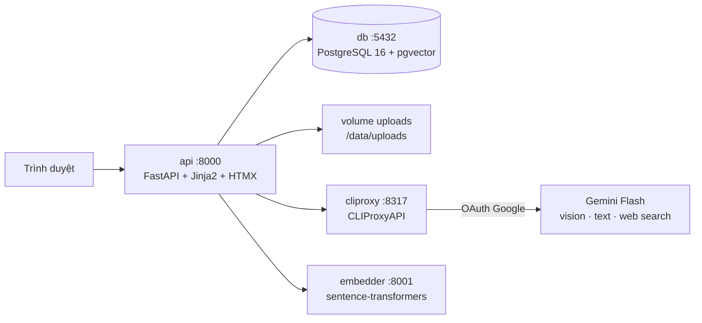

# BusinessCard_OCR

Số hoá danh thiếp và lập hồ sơ doanh nghiệp đối tác. Bản demo chạy localhost, quản lý bằng Docker.

- Kế hoạch dự án: [Plan.md](./Plan.md)
- Nhiệm vụ từng ngày: [Task.md](./Task.md)
- Chỉ mục tài liệu: [docs/README.md](./docs/README.md)
- Hướng dẫn sử dụng (có ảnh màn hình): [docs/user-guide.md](./docs/user-guide.md)
- Quy ước cho AI agent: [AGENTS.md](./AGENTS.md)

> **Trạng thái: xong D1–D10, đang ở D11 (bàn giao).** Cả ba chức năng F1/F2/F3 chạy thật trong
> Docker. Số đo hiện có: trợ lý AI **10/10** câu của bộ chấm A6 + 3/3 câu chặn ngoài phạm vi,
> OCR **100%** trường đúng trên ảnh sắc nét (89,3% khi làm nhoè r=4), **416 test** xanh. Tiêu chí
> **A3** (≥85% trên **30 ảnh chụp thật**) chưa đo được vì `samples/cards/` còn trống — xem
> [docs/accuracy.md](./docs/accuracy.md). Số task cập nhật từng ngày ở [Task.md](./Task.md).

## Ba chức năng

1. **Số hoá danh thiếp qua ảnh** (F1) — Gemini Flash Vision trích xuất công ty, họ tên, chức vụ,
   email, SĐT, địa chỉ, website; hệ thống chuẩn hoá SĐT về E.164 và người dùng luôn review trước
   khi xác nhận. Đọc được thẻ Anh/Việt/Nhật/Hàn/Trung.
2. **Hồ sơ doanh nghiệp đối tác** (F2) — người dùng **chủ động tích chọn** công ty rồi bấm tạo;
   hệ thống tìm kiếm Internet + LLM tổng hợp, **mọi trường phải kèm URL nguồn**, trường không có
   nguồn thì để trống chứ không bịa.
3. **Trợ lý AI hỏi–đáp (RAG)** (F3) — hỏi đáp trên danh thiếp + hồ sơ đã tạo, trả lời kèm trích
   dẫn bấm được; hỏi ngoài dữ liệu thì nói không có thông tin.

## Kiến trúc



| Service | Vai trò | Ghi chú |
|---------|---------|---------|
| `api` | REST API + Web UI | Build từ `Dockerfile`; entrypoint tự chạy `alembic upgrade head` |
| `db` | PostgreSQL 16 + pgvector | Index `ivfflat` (cosine) trên `kb_chunks.embedding` |
| `cliproxy` | Cổng OAuth + gateway tới Gemini | Image công khai, **không build từ mã nguồn** |
| `cliproxy-init` | Chạy một lần rồi thoát | Tạo `cliproxy/config.yaml` từ bản mẫu nếu chưa có |
| `embedder` | Sinh vector cho RAG | Model `multilingual-e5-small` **nhúng sẵn trong image** |
| `adminer` | Xem DB khi debug | Tuỳ chọn, chỉ dùng lúc phát triển |

**Sinh nội dung đi qua CLIProxyAPI bằng OAuth — không nhúng API key.** Riêng **embedding KHÔNG đi
qua CLIProxy**: CLIProxy không có endpoint embedding (đã kiểm chứng trong mã nguồn), nên phần này
do service `embedder` cục bộ đảm nhiệm. Lý do đầy đủ: [Plan.md](./Plan.md) mục 2.6.

Dữ liệu: `business_cards`, `companies`, `company_profiles`, `kb_chunks`, `chat_sessions` /
`chat_messages`, `enrich_jobs`, `integration_status` — sơ đồ ở [docs/erd.md](./docs/erd.md).

## Yêu cầu môi trường

| | Tối thiểu | Vì sao |
|---|---|---|
| Docker | Docker Desktop hoặc Docker Engine + Compose v2 | Toàn bộ hệ thống chạy bằng Compose |
| RAM trống | **4 GB** | 5 container lúc nhàn rỗi tốn ~1 GB, riêng `embedder` ~760 MB sau khi nạp model |
| Đĩa trống | **~15 GB** | Image tổng ~4,1 GB, nhưng lúc **build** `embedder` cần thêm ~8 GB tạm cho `torch` |
| Mạng | Chỉ cần lúc build + lúc gọi model | Model embedding nằm sẵn trong image nên RAG chạy được cả khi mất mạng |
| Tài khoản | Một Gmail để bấm OAuth | Không cần API key, không cần thẻ tín dụng |

Chạy ngoài Docker thì thêm Python 3.12 (xem mục *Phát triển ở máy*).

## Cài đặt & chạy

```bash
git clone <repo> && cd BusinessCard_OCR
docker compose up -d
curl localhost:8000/health   # -> {"status":"ok"}
```

**Đúng một lệnh, không phải chép file nào trước** — và cũng **không cần cài Go hay clone
CLIProxyAPI về máy**:

- `cliproxy-init` tự tạo `cliproxy/config.yaml` từ `config.example.yaml` nếu máy chưa có;
- entrypoint của `api` tự chạy `alembic upgrade head` trước khi mở cổng;
- mọi biến môi trường đều có mặc định trong `docker-compose.yml`, `.env` là **tuỳ chọn**.

> **Lần đầu mất vài phút** vì phải build `embedder`: image kéo `torch` CPU và nhúng sẵn model
> ~470 MB vào trong. Cố ý làm vậy — máy không có mạng vẫn chạy được (tiêu chí **A1**).

Đổi cấu hình thì `cp .env.example .env`, sửa, rồi `docker compose up -d api`. Đổi
`CLIPROXY_MGMT_KEY` thì phải đổi **cả** `remote-management.secret-key` trong
`cliproxy/config.yaml` cho trùng.

| Địa chỉ | Là gì |
|---------|-------|
| http://localhost:8000 | Web UI |
| http://localhost:8000/docs | Swagger tự sinh — **tài liệu API chính** sau D1 |
| http://localhost:8000/settings | Kết nối OAuth, chọn model, kiểm tra kết nối |
| http://localhost:8080 | Adminer, xem DB khi debug (server `db`, user/pass `bizcard`) |
| http://localhost:8317 | CLIProxyAPI — Management API + gateway tới Gemini |
| localhost:51121 | Callback OAuth; không mở tay, trình duyệt tự quay về |
| http://localhost:8001 | Service `embedder` (`/health`, `/embed`) |

### Kết nối AI (bắt buộc trước khi quét hay tạo hồ sơ)

1. Mở **http://localhost:8000/settings**.
2. Bấm **Kết nối CLIProxy (OAuth)** → tab mới mở trang đăng nhập Google → đồng ý.
3. Trình duyệt tự quay về, badge chuyển **Đã kết nối** kèm địa chỉ Gmail và danh sách model.
4. Bấm **Kiểm tra kết nối** để gọi thử một prompt ngắn.

Token nằm trong volume `cliproxy_auths` nên sống qua `docker compose restart`. `docker compose
down -v` xoá volume đó → **phải bấm kết nối lại**. Chi tiết và các bẫy đã gặp:
[docs/oauth-setup.md](./docs/oauth-setup.md).

### Nạp dữ liệu mẫu

```bash
# Bộ dữ liệu cố định của bộ câu hỏi chấm điểm A6 (3 công ty + 4 danh thiếp)
docker compose exec api python -m scripts.seed

# Bộ demo: 7 thẻ thật ở trạng thái cuối buổi demo, KHÔNG gọi model lần nào
docker compose exec api python -m scripts.seed --demo
```

Hai bộ khác nhau và khác mục đích — đọc docstring đầu `scripts/seed.py` trước khi dùng. Bộ
`--demo` là lưới an toàn khi mạng hoặc OAuth hỏng giữa buổi trình bày; nạp nó rồi thì **không
quét lại được đúng những tấm ảnh đó** (hệ thống chặn trùng ảnh), dọn bằng
`samples/demo/reset_demo.sql` hoặc `--reset --demo`.

## Troubleshooting

| Triệu chứng | Nguyên nhân | Cách xử lý |
|-------------|-------------|------------|
| `/settings` báo **Chưa kết nối** dù vừa bấm OAuth xong | Cổng `51121` không được publish → Google gọi callback về hư không, token không bao giờ được lưu (I-04) | Kiểm `docker compose ps` thấy `51121` trong danh sách cổng của `cliproxy`; bấm kết nối lại |
| Gọi model trả `403 remote management disabled` | `allow-remote: false` — CLIProxy hiểu "localhost" đúng nghĩa `127.0.0.1`, còn `api` gọi qua mạng bridge của Docker (I-01) | Đặt `allow-remote: true` trong `cliproxy/config.yaml` |
| Gọi model trả `400 unknown provider for model …` | **Hai nguyên nhân trùng câu chữ**: chưa kết nối OAuth, hoặc `LLM_MODEL` không có trong channel | Xem badge ở `/settings`; danh sách model thật nằm ngay trên trang đó |
| Badge lúc nào cũng xanh kể cả khi chưa đăng nhập bao giờ | Dùng `get-auth-status` không kèm `state` để vẽ badge (I-02) | Nguồn sự thật cho badge là `auth-files`, không phải `get-auth-status` |
| `cliproxy` khởi động lỗi, `config.yaml` là một **thư mục** | Bind mount kiểu file: Docker dựng đường dẫn lúc *create*, trước khi `cliproxy-init` kịp chạy | Đã sửa từ 9.1 (mount cả thư mục `./cliproxy`). Gặp lại thì xoá thư mục rỗng đó rồi `up -d` |
| Upload lại đúng tấm ảnh cũ → **200** kèm `duplicate: true`, không quét lại | Chống trùng theo `image_hash`, cố ý không gọi lại model | Muốn quét lại thì xoá bản ghi cũ, hoặc dùng `reset_demo.sql` với bộ ảnh demo |
| Xác nhận thẻ xong nhưng trợ lý AI không thấy | `embedder` còn đang nạp model lúc bấm Xác nhận — F3 hỏng cố ý **không** chặn F1 | Chờ `embedder` healthy rồi bấm **Index lại** ở trang Trợ lý AI (`POST /api/kb/reindex`) |
| Trợ lý trả "không có thông tin" dù dữ liệu có trong DB | Index `ivfflat` học phân cụm từ dữ liệu *lúc tạo index*; nạp dữ liệu sau khi tạo index thì centroid vô nghĩa (I-22) | `scripts/seed.py` đã tự `REINDEX`; nạp tay thì gọi `POST /api/kb/reindex` |
| Câu hỏi tiếng Việt **gõ không dấu** không ra gì | Hạn chế đã biết (I-23 / B-10), chưa xử lý | Gõ có dấu |
| Model trả `429 cooldown` | Tài khoản Google bị giới hạn tạm thời | Đổi `LLM_MODEL` sang model khác ở `/settings`, hoặc chờ |
| `alembic` báo nhiều head | Hai người cùng sinh revision | **Chỉ Q sinh Alembic revision**; CI có job bắt lỗi này |
| Script Python chết ngay dòng in đầu tiên trên Windows | stdout về `cp1252` khi không phải console, chữ Việt/Nhật không mã hoá được (B-01) | Đặt `PYTHONIOENCODING=utf-8`, hoặc chạy trong container |
| Sau `docker compose down -v` mọi thứ trống trơn | `-v` xoá cả `pgdata`, `uploads` **và** `cliproxy_auths` | Kết nối lại OAuth rồi `python -m scripts.seed` |

Nhật ký bug đầy đủ: [docs/bugs-f1-f3.md](./docs/bugs-f1-f3.md) (F1/F3) và
[docs/bugs-f2.md](./docs/bugs-f2.md) (F2).

## Phát triển ở máy (không qua Docker)

```bash
python -m venv .venv && .venv/Scripts/activate      # Windows
pip install -r requirements.txt
ruff check . && ruff format --check . && mypy app embedder scripts && pytest
```

Đúng bốn lệnh kiểm tra trên là những gì CI chạy trên PR — chạy trước ở máy cho đỡ mất lượt.
`pytest` cần một PostgreSQL có pgvector: mặc định dùng service `db` của Compose, nên cứ
`docker compose up -d db` trước. Chi tiết CI: [.github/workflows/README.md](./.github/workflows/README.md).

## Quy ước làm việc

**Sở hữu file.** Mỗi file có đúng một chủ (Q hoặc T) — bảng sở hữu nằm ở đầu
[Task.md](./Task.md). Không sửa file của người kia; cần đổi thì báo chủ file.
⚠️ **Nới từ D12**: được sửa file của nhau, đổi lại phải báo tại daily trước khi chạm và **chủ
file review PR**. Riêng **Alembic revision vẫn chỉ Q sinh** (hai người cùng sinh sẽ tạo 2 head
phải merge tay; CI có job bắt lỗi này).

**Nhánh.** `main` luôn ở trạng thái chạy được, chỉ nhận PR. Nhánh làm việc đặt tên
`<loại>/<module>-<việc>`:

```
feat/cards-upload        fix/ocr-json-hong        docs/erd
feat/companies-enrich    chore/ci-gitleaks        refactor/kb-chunking
```

PR nhỏ, **merge trong ngày**, rebase lên `main` trước khi merge, không để nhánh sống qua đêm.
PR phải **xanh CI** mới được merge — check tên `CI success`. ⚠️ Nhưng `main` **chưa bật được
branch protection** (repo private trên gói Free, xem I-14 trong `Task.md`), nên hiện tại không có
gì chặn PR đỏ: tự chạy đủ kiểm tra ở máy trước khi merge.

**Commit.** Theo [Conventional Commits](https://www.conventionalcommits.org/):

```
<loại>(<phạm vi>): <mô tả ngắn, chữ thường, không dấu chấm cuối>
```

| Loại | Dùng khi |
|------|----------|
| `feat` | Thêm chức năng |
| `fix` | Sửa lỗi |
| `docs` | Chỉ đổi tài liệu |
| `refactor` | Đổi cấu trúc, không đổi hành vi |
| `test` | Thêm/sửa test |
| `chore` | Hạ tầng, CI, cấu hình |

Phạm vi dùng tên module: `cards`, `companies`, `kb`, `chat`, `integration`, `embedder`, `db`, `ci`.
Ví dụ: `feat(cards): them endpoint upload va tinh image_hash`.

**Trạng thái task.** Code xong phải cập nhật đúng dòng trong `Task.md` (⬜ / 🔄 / ✅ / ⏸️ / ❌)
và dòng `**Tổng quan:** x / y task`. Chưa đạt DoD (chạy trong Docker + đã test + đã merge `main`)
thì **không** đánh ✅.

## Lưu ý kiến trúc

- **Sinh nội dung** đi qua CLIProxyAPI bằng OAuth — không nhúng API key.
- **Embedding KHÔNG đi qua CLIProxy** (CLIProxy không có endpoint embedding). Dùng service
  `embedder` cục bộ, model nhúng sẵn trong image. Chi tiết: `Plan.md` mục 2.6.
- **Xác nhận danh thiếp không tự sinh hồ sơ doanh nghiệp.** Người dùng chủ động tích chọn công ty
  rồi bấm nút — xem `Plan.md` mục 2.2, Luồng 1 / Luồng 2.
- **Hồ sơ chỉ giữ trường có nguồn.** Không có URL chứng minh thì để trống, không đoán (rủi ro R4).
- Router khai sẵn cả 7 module từ D1: chủ sở hữu chỉ cần khai biến `router = APIRouter(...)` trong
  file của mình là tự được gắn vào app — không ai phải sửa `app/main.py`. Xem
  `app/routers/__init__.py`.
