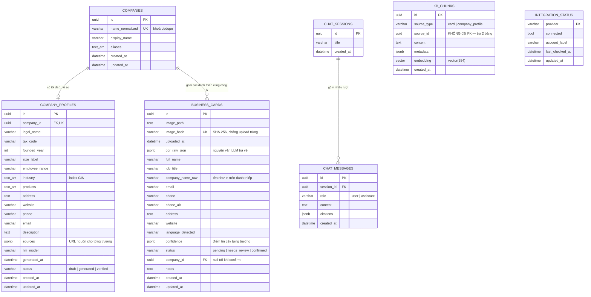

# ERD — Sơ đồ quan hệ thực thể

> Chủ sở hữu: **Q** · Task **1.5** · T review qua PR, không sửa trực tiếp file này.
> Nguồn sự thật của schema là migration `alembic/versions/20260910_0900-0001_khoi_tao_schema.py`
> (task 1.6). File này giải thích *tại sao*, migration mới là *cái gì*.

## 1. Sơ đồ

## 2. Các quyết định thiết kế cần T review

| # | Quyết định | Lý do | Ảnh hưởng tới F2 |
|---|-----------|-------|------------------|
| 1 | **`company_profiles.company_id` là UNIQUE** — mỗi công ty đúng một hồ sơ | Nút "Tạo lại hồ sơ" (task 6.7) ghi đè bản cũ thay vì sinh thêm dòng; trang chi tiết công ty khỏi phải chọn "hồ sơ nào" | T cần `upsert` khi enrich lại, không `insert` |
| 2 | **`kb_chunks.source_id` không có khoá ngoại** | Trỏ tới `business_cards` hoặc `company_profiles` tuỳ `source_type` | Xoá hồ sơ DN thì T phải gọi dọn chunk (hàm `kb.*` của Q) |
| 3 | **`business_cards.company_id` nullable** | Danh thiếp chỉ được gắn công ty khi người dùng bấm Xác nhận (task 4.3) | `upsert_company()` trả `company_id` cho `cards.confirm` |
| 4 | **`companies.name_normalized` UNIQUE** | Khoá dedupe, giá trị do `normalize_company.normalize_company_name()` sinh (task 3.7) | Đổi thuật toán chuẩn hoá sau khi đã có dữ liệu ⇒ phải backfill; chốt sớm |
| 5 | **`status` lưu bằng `varchar`, không dùng ENUM của Postgres** | Thêm giá trị mới không cần migration `ALTER TYPE`; giá trị hợp lệ ràng buộc ở tầng Python (`StrEnum`) | Không |
| 6 | **`ocr_raw_json` giữ nguyên văn LLM trả về** | Đo lại độ chính xác (task 7.8/10.8) mà không phải quét lại ảnh | Không |

## 3. Index

| Index | Bảng | Kiểu | Tạo ở | Mục đích |
|-------|------|------|-------|----------|
| `ix_business_cards_image_hash` | `business_cards` | unique btree | 1.6 | Upload trùng ảnh → không tạo bản ghi mới (task 3.1) |
| `ix_business_cards_status` | `business_cards` | btree | 1.6 | Lọc theo trạng thái ở màn hình danh sách (task 4.1) |
| `ix_business_cards_company_id` | `business_cards` | btree | 1.6 | Danh sách liên hệ của một công ty (task 7.9) |
| `ix_companies_name_normalized` | `companies` | unique btree | 1.6 | Dedupe công ty (task 3.8) |
| `ix_company_profiles_industry` | `company_profiles` | **GIN** | 1.6 | Lọc theo ngành nghề |
| `ix_kb_chunks_source` | `kb_chunks` | btree (2 cột) | 1.6 | Reindex lại đúng một nguồn (task 6.4) |
| `ivfflat` trên `embedding` | `kb_chunks` | **ivfflat (cosine)** | **6.3** | Vector search. Cố ý tạo muộn: ivfflat cần sẵn dữ liệu để học phân cụm |

## 4. Ghi chú triển khai

- **Số chiều vector = 384** (`intfloat/multilingual-e5-small`, Plan.md mục 2.6). Task 2.6 chốt
  model khác số chiều thì **T báo Q ngay trong ngày** để Q sinh revision đổi kiểu cột **trước D6**.
- Vector chuẩn hoá L2, so khớp bằng khoảng cách cosine — khớp với index `ivfflat` ở mục 3.
- `kb_chunks.metadata` là tên cột trong DB; trong ORM thuộc tính đặt là `meta` vì `metadata`
  là tên dành riêng của SQLAlchemy.
- **Chỉ Q sinh Alembic revision** (quy ước số 5, Task.md). T cần đổi schema → báo Q.
- Bảng `companies` / `company_profiles` đã tồn tại trong DB từ migration `0001`; **model ORM
  (`app/models/company.py`) do T viết**, xong ở task 3.8. Q gỡ nốt phần nợ ngày 2026-09-14
  (I-16): `alembic/env.py` không còn bỏ qua hai bảng ấy khi autogenerate, `app/models/card.py`
  khai lại `ForeignKey("companies.id", ondelete="SET NULL")`. Đo lại bằng `alembic check` trên
  Postgres thật: *No new upgrade operations detected* — ERD, migration và model nay khớp nhau.
- Bảng theo dõi **job lập hồ sơ hàng loạt** (task 5.8 — `enrich-batch` trả `job_id`) chưa có
  trong ERD này vì Plan.md mục 3 không liệt kê. T chốt cấu trúc job rồi báo Q sinh revision bổ
  sung, chậm nhất đầu D5.
