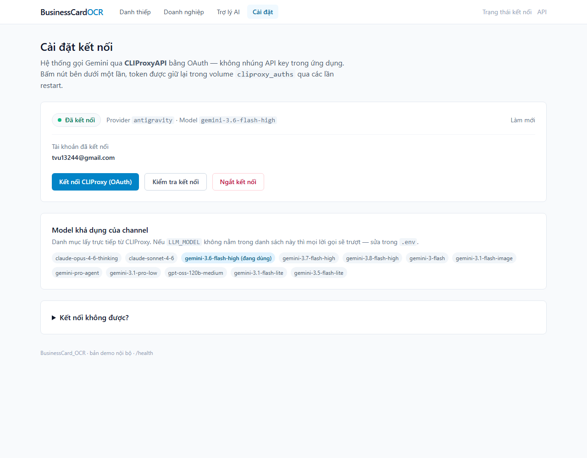
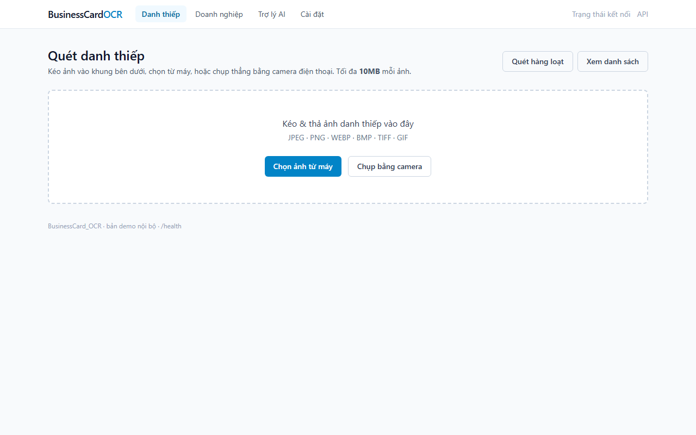
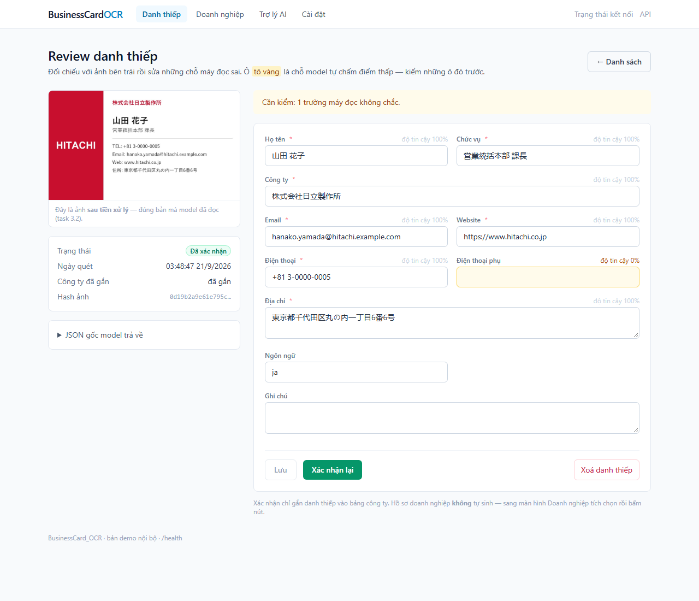
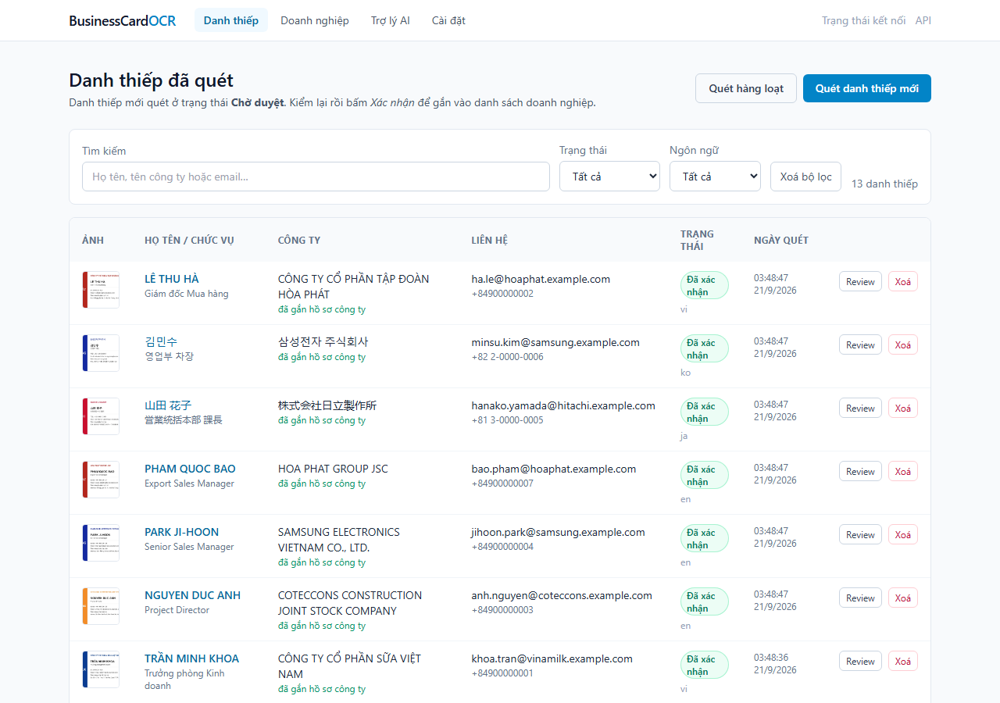
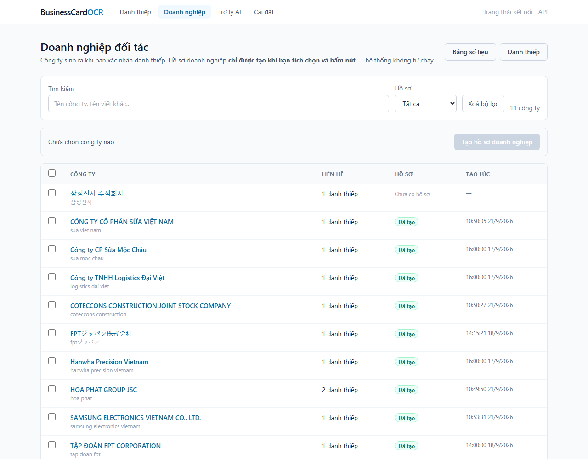
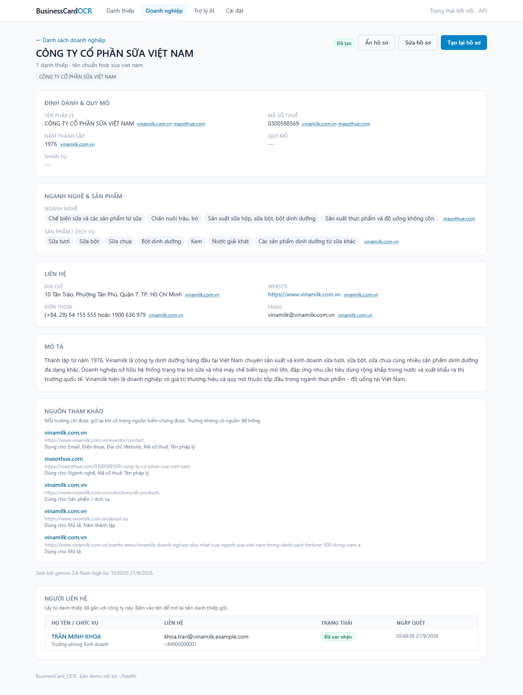
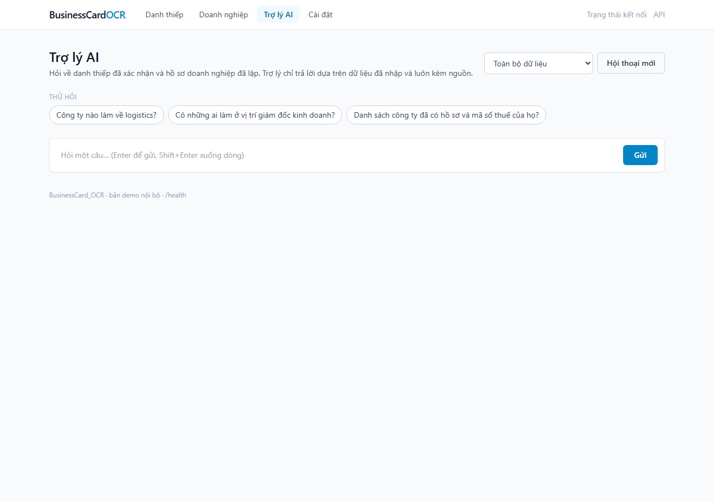
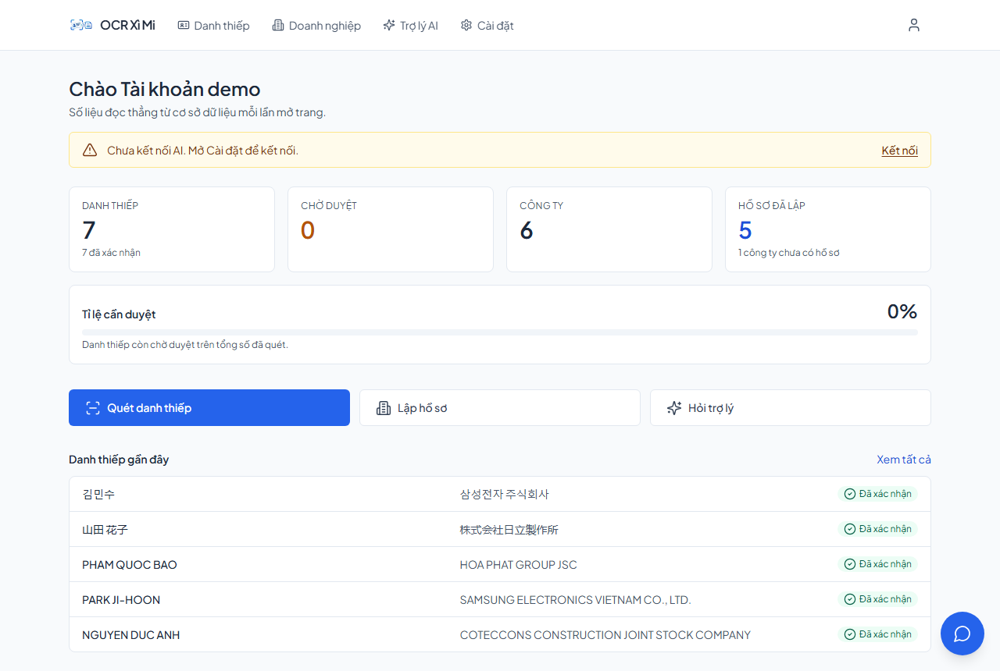

# Hướng dẫn sử dụng

> Chủ sở hữu: **T** · Task: **11.6**, **13.1**, **NEXT-05** · Dành cho: người dùng cuối (không cần biết lập trình) · Cập nhật: 2026-09-27
> Cài đặt và chạy hệ thống: xem `README.md` (Q). Kịch bản trình diễn: `docs/demo-runbook.md`.

BusinessCard OCR biến danh thiếp thu được ở hội thảo thành **hồ sơ đối tác có nguồn**, theo ba bước:

1. **Quét danh thiếp** → máy đọc chữ, bạn kiểm lại rồi xác nhận.
2. **Tạo hồ sơ doanh nghiệp** cho những công ty bạn chọn → máy tra cứu Internet, chỉ giữ thông tin **có nguồn**.
3. **Hỏi trợ lý AI** về danh thiếp và hồ sơ đã có → câu trả lời luôn kèm nguồn bấm được.

Mở trình duyệt tại **http://localhost:8000**. Thanh trên cùng có ba mục: *Danh thiếp*, *Doanh nghiệp*, *Cài đặt*.
Làm việc chung với đồng nghiệp: xem mục 8, *Không gian làm việc*.
Trợ lý AI không nằm trên thanh này mà là **bong bóng tròn ở góc phải dưới**, bấm được từ bất kỳ trang nào.

---

## 1. Kết nối lần đầu — *Cài đặt*

Hệ thống gọi Gemini qua CLIProxy bằng đăng nhập Google, không cần API key. **Mỗi tài khoản trong hệ thống tự kết nối
bằng tài khoản Google của chính mình**: mọi lời quét thẻ, tạo hồ sơ, hỏi trợ lý của bạn chỉ đi bằng tài khoản Google
bạn đã nối, không bao giờ mượn của người khác, và bạn bấm **Ngắt kết nối** cũng không ảnh hưởng ai.

1. Bấm **Kết nối CLIProxy (OAuth)** → một tab Google mở ra → đăng nhập và đồng ý.
2. Quay lại trang, trạng thái chuyển *Đã kết nối*, kèm tài khoản và danh sách model.
3. Bấm **Kiểm tra kết nối**. Có câu trả lời của model là dùng được.

> ⚠️ **Dùng tài khoản Gmail cá nhân.** Tài khoản của trường hoặc công ty (Google Workspace, ví dụ đuôi `.edu.vn`)
> có thể vẫn hiện *Đã kết nối* nhưng mọi lời gọi đều lỗi `missing project_id`. Gặp lỗi này thì bấm **Ngắt kết nối**
> rồi kết nối lại bằng Gmail cá nhân.

Chỉ cần làm một lần; đăng nhập được giữ lại qua các lần khởi động lại. Một tài khoản Google chỉ phục vụ **một**
tài khoản trong hệ thống — người thứ hai nối cùng Gmail đó sẽ bị từ chối.

## 2. Quét danh thiếp — *Danh thiếp*

- **Một tấm**: *Danh thiếp* → *Quét danh thiếp* → kéo ảnh vào khung, **Chọn ảnh từ máy**, hoặc **Chụp bằng camera**
  trên điện thoại. Ảnh tối đa 10 MB; JPEG, PNG, WEBP, BMP, TIFF, GIF.
- **Nhiều tấm**: **Quét hàng loạt**, chọn tối đa 50 ảnh. Máy đọc 2 ảnh cùng lúc ở nền; đóng tab cũng không sao.
- Hệ thống đọc được danh thiếp **tiếng Việt, Anh, Nhật, Hàn, Trung**.
- Tải lại **đúng một ảnh đã quét** sẽ không tạo bản ghi trùng.

## 3. Kiểm và xác nhận danh thiếp

Sau khi quét, danh thiếp ở trạng thái *Chờ duyệt*. Màn hình review đặt ảnh bên trái, các ô đọc được bên phải.

1. Đối chiếu từng ô với ảnh. Ô **tô vàng** là ô máy tự đánh giá kém chắc chắn, nên kiểm trước.
2. Sửa ô sai rồi **Lưu**. Số điện thoại và email được chuẩn hoá tự động (ví dụ `0900 000 001` → `+84900000001`).
3. Bấm **Xác nhận**. Danh thiếp chuyển *Đã xác nhận* và được gắn vào một **công ty**. Công ty chưa có thì hệ thống
   tạo mới; đã có (kể cả khi tên in khác nhau, ví dụ *"Tập đoàn Hòa Phát"* và *"Hoa Phat Group JSC"*) thì gắn vào
   công ty đó.

> Máy có thể tự tin mà vẫn sai (ví dụ đọc tên phòng ban thành chức vụ). **Luôn liếc qua mọi ô**, không chỉ ô vàng.

Trang *Danh thiếp* liệt kê mọi thẻ, tìm theo tên / công ty / email, lọc theo trạng thái và ngôn ngữ.

## 4. Tạo hồ sơ doanh nghiệp — *Doanh nghiệp*

Xác nhận danh thiếp **không** tự tạo hồ sơ. Bạn chủ động chọn công ty cần tra cứu:

1. Tích chọn một hoặc nhiều công ty (tối đa 50 mỗi lượt) → **Lập hồ sơ**.
2. Cột *Hồ sơ* của từng dòng hiện tiến trình: *⏳ Đang chờ* → *⏳ Đang tạo…* → *✅ Xong · N trường có nguồn*.
   Mỗi công ty mất khoảng 30–60 giây; tối đa 2 công ty chạy cùng lúc. Tải lại trang giữa chừng vẫn theo dõi tiếp.
3. **Bấm nhầm hoặc chờ quá lâu?** Bấm **Huỷ** trên dòng đó, hoặc **Huỷ tất cả** cho cả lượt.
4. Dòng *❌ Lỗi* ghi lý do ngay tại chỗ (chưa kết nối, hết lượt gọi…). Sửa nguyên nhân rồi bấm **Chạy lại**.

Bộ lọc *Hồ sơ*: *Chưa có hồ sơ* / *Đã có hồ sơ* / *Đã ẩn*. Nút **Xoá lọc** trả bộ lọc về mặc định.

## 5. Đọc và quản lý một hồ sơ

Bấm tên công ty để mở hồ sơ:

- **Định danh & quy mô, Ngành nghề & sản phẩm, Liên hệ**: mỗi trường có đường dẫn nhỏ tới **trang nguồn** bên cạnh.
- **Nguồn tham khảo**: danh sách trang đã dùng, ghi rõ từng trang chứng minh cho trường nào.
- **Không có nguồn thì để trống.** Hệ thống không bao giờ điền một thông tin mà nó không chỉ ra được nguồn; ô trống
  nghĩa là *"không tìm thấy nguồn kiểm chứng được"*, không phải lỗi.
- **Người liên hệ**: những danh thiếp đã gắn với công ty; bấm tên để mở lại tấm thẻ gốc.
- **Công ty liên quan** (nếu có):
  - *Trùng mã số thuế*: có thể cùng một công ty đang bị lưu thành hai.
  - *Cùng tên miền email / website*: thường là cùng tập đoàn hoặc công ty con. Chỉ để tham khảo, hệ thống không tự
    gộp.

Các nút trên đầu trang:

| Nút | Làm gì |
|-----|--------|
| **Sửa hồ sơ** | Sửa tay từng trường. Trường đã sửa được coi là *đã kiểm bằng người* (nguồn cũ của trường đó bị gỡ) và hồ sơ chuyển *Đã kiểm* |
| **Tạo lại hồ sơ** | Tra cứu lại từ đầu, **ghi đè** cả phần sửa tay (có hộp xác nhận) |
| **Huỷ tạo hồ sơ** | Hiện khi đang tạo; huỷ thì hồ sơ cũ (nếu có) giữ nguyên |
| **Ẩn hồ sơ** | Giấu hồ sơ khỏi danh sách, ô tìm kiếm và trợ lý AI; dữ liệu vẫn giữ. Bấm **Hiện lại** trên dải thông báo để khôi phục |

## 6. Hỏi trợ lý AI — *bong bóng góc phải dưới*

> ⚠️ Ảnh trên chụp **màn hình trợ lý riêng**, tức bản trước `EX-09` — nó được chụp lại ở `14.11`
> nhưng từ nhánh mà trang đó còn tồn tại. `scripts/make_doc_screenshots.py` **đã sửa** để chụp
> bong bóng, nên chạy lại một lệnh là ảnh khớp trở lại. Chữ dưới đây đã đúng với bản hiện tại.

- Bấm **bong bóng tròn góc phải dưới** — có trên mọi trang, không phải đi tới trang riêng nào. Đóng bằng phím
  `Esc` hoặc dấu `×`; hội thoại **không mất** khi bạn chuyển sang trang khác.
- Bấm nút **phóng to** trên đầu panel để mở rộng ra giữa màn hình khi câu trả lời dài hoặc nhiều nguồn; bấm lần
  nữa để thu lại. Máy nhớ lựa chọn này cho các lần sau.
- Gõ câu hỏi tiếng Việt tự nhiên, ví dụ *"Công ty nào làm về logistics?"*, *"Ai là giám đốc mua hàng ở Hòa Phát?"*,
  *"Mã số thuế của Coteccons?"*. Có sẵn vài câu hỏi mẫu để bấm thử.
- Chọn phạm vi ngay dưới tiêu đề panel: *Toàn bộ dữ liệu* / *Chỉ danh thiếp* / *Chỉ hồ sơ doanh nghiệp*.
- Mỗi câu trả lời kèm **thẻ nguồn**; bấm để mở danh thiếp hoặc hồ sơ gốc. Hỏi tiếp trong cùng hội thoại được
  (*"Số điện thoại của chị ấy?"*); bấm **Hội thoại mới** để bắt đầu lại.
- Hỏi điều không có trong dữ liệu (*"Giá vàng hôm nay?"*) thì trợ lý trả lời **không có thông tin**, không đoán.
- Hồ sơ đã **ẩn** không được dùng để trả lời.

## 7. Trang chủ và xuất dữ liệu

- **Trang chủ** (biểu tượng OCR Xì Mi trên thanh trên cùng): tổng danh thiếp, đã xác nhận, chờ duyệt, số công ty, số hồ sơ,
  tỉ lệ cần review. Bấm một ô để mở danh sách tương ứng.
- **Xuất dữ liệu** — mở các địa chỉ sau, trình duyệt tải file về:

| Địa chỉ | Nội dung |
|---------|----------|
| `/api/export/cards.csv` | Toàn bộ danh thiếp (thêm `?status=confirmed` để chỉ lấy thẻ đã xác nhận) |
| `/api/export/companies.csv` | Công ty + hồ sơ; cột `sources` là danh sách nguồn |
| `/api/export/cards.json`, `/api/export/companies.json` | Cùng dữ liệu, dạng JSON |

File CSV mở thẳng bằng Excel, không vỡ chữ tiếng Việt, Nhật, Hàn.

## 8. Làm việc chung — *Không gian làm việc*

**Danh thiếp, công ty và hồ sơ thuộc về không gian làm việc, không thuộc về tài khoản bạn.** Mọi thành viên trong cùng
một không gian nhìn thấy cùng một dữ liệu; hai không gian khác nhau thì không đường nào đọc sang nhau, kể cả qua trợ lý
AI hay file xuất ra.

Lần đầu đăng nhập, hệ thống tạo sẵn cho bạn một không gian riêng mang tên bạn, và bạn là **quản trị** của nó. Muốn làm
việc một mình thì không cần đụng tới mục này.

Mở bằng **biểu tượng người** trên thanh trên cùng → **Không gian làm việc**.

| Vai trò | Làm được gì |
|---------|-------------|
| **Quản trị** | Mọi thứ *Thành viên* làm được, cộng thêm: mời người mới, gỡ người, đổi vai trò, đổi tên không gian |
| **Thành viên** | Quét, sửa, xoá danh thiếp; tạo hồ sơ; hỏi trợ lý; xuất dữ liệu |
| **Chỉ xem** | Chỉ đọc và xuất dữ liệu — không sửa được gì |

**Mời người khác vào cùng làm:**

1. Người bạn muốn mời **tự đăng ký tài khoản trước** — hệ thống không gửi thư mời.
2. Bạn (quản trị) gõ đúng email họ đã đăng ký, chọn vai trò, bấm **Thêm**.
3. Họ đăng nhập, mở cùng trang này, bấm **Chuyển sang** không gian của bạn.

**Giao việc:** trong trang một danh thiếp, panel *Theo dõi liên hệ* có ô **người phụ trách** — chỉ chọn được người đang
ở trong không gian.

**Gỡ một người:** dữ liệu họ đã nhập **ở lại** với tổ chức, chỉ những liên hệ đang giao cho họ được trả về *chưa giao*
để người khác nhận. Không gian luôn phải còn ít nhất một quản trị, nên người quản trị cuối cùng không tự rời được —
hãy nâng người khác lên quản trị trước.

**Tạo thêm không gian** (nút *Tạo*) khi bạn cần tách dữ liệu của hai việc khác hẳn nhau. Không gian mới bắt đầu rỗng,
và bạn chuyển qua lại bất cứ lúc nào.

## 9. Khi gặp sự cố

| Hiện tượng | Nguyên nhân thường gặp | Cách xử lý |
|------------|------------------------|------------|
| Tạo hồ sơ báo *Chưa kết nối CLIProxy* | Chưa đăng nhập hoặc token hết hạn | *Cài đặt* → **Kết nối CLIProxy (OAuth)** |
| Máy đã từng kết nối trước khi có đăng nhập nhiều người, nay báo *chưa kết nối AI* | Credential cũ chưa thuộc về tài khoản nào | Mỗi người vào *Cài đặt* bấm **Kết nối CLIProxy (OAuth)** một lần; đăng nhập lại đúng Gmail cũ cũng được |
| Kết nối báo *tài khoản Google … đang được một người dùng khác kết nối* | Gmail đó đã gắn với tài khoản khác trong hệ thống | Dùng Gmail của riêng bạn |
| Mọi lời gọi lỗi `missing project_id` dù đang *Đã kết nối* | Đăng nhập bằng tài khoản Workspace | Ngắt kết nối, đăng nhập lại bằng Gmail cá nhân |
| Lỗi *429* / *cooldown* | Tài khoản hết lượt gọi model đó trong lúc này | Đợi vài phút rồi **Chạy lại**, hoặc đổi `LLM_MODEL` sang `gemini-3-flash` |
| Hồ sơ có ít trường | Công ty ít thông tin công khai; hệ thống bỏ mọi trường không có nguồn | Bình thường. Bổ sung bằng **Sửa hồ sơ** nếu bạn có thông tin đáng tin |
| Công ty kẹt *Đang tạo…* sau khi khởi động lại hệ thống | Lượt chạy bị ngắt giữa chừng | Bấm **Huỷ** trên dòng đó rồi tạo lại |
| Một công ty xuất hiện hai lần | Tên in trên hai thẻ khác nhau quá xa | Xem khối *Công ty liên quan*; gộp tay chưa hỗ trợ trong bản demo |
| Đổi `LLM_MODEL` trong `.env` mà không có tác dụng | Container giữ cấu hình cũ | Trong thư mục dự án: `docker compose up -d api` (không dùng *Restart*) |
